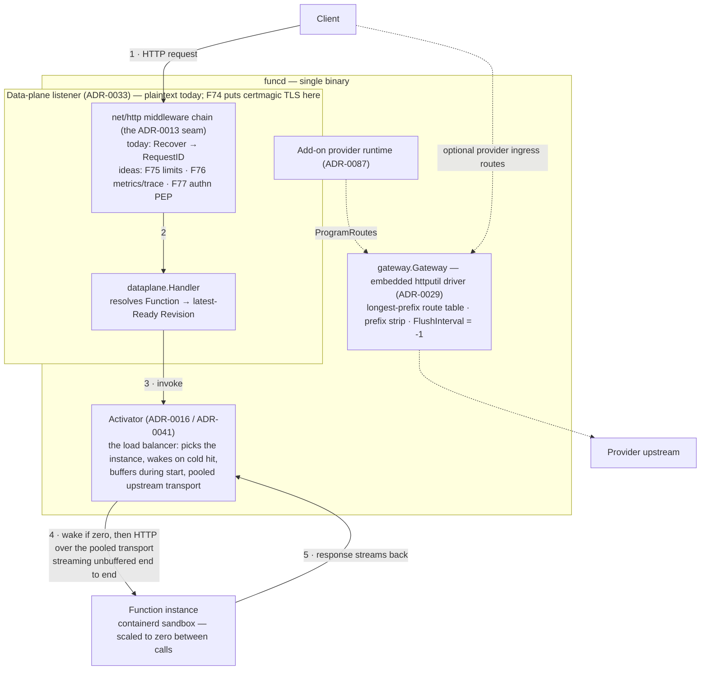

# FEAT-0006: Ingress hardening — the edge the gateway should own

- **Status**: Active (living document — the tracking table updates as ADRs progress)
- **Date**: 2026-07-07
- **Deciders**: green-0-rabbit
- **Defines**: an **additive edge-hardening epoch** for the HTTP ingress — TLS, traffic
  protection, edge observability, an authn hook, and edge shaping — scoped by a survey of a
  full programmable-API-gateway feature catalogue (the
  [Pingora gateway guide](https://dev.to/warren_jitsing_dd1c1d6fc6/pingora-guide-how-to-make-a-programmable-api-gateway-1oim)).
  Its defining constraint is **what it refuses to build**: funcd's edge is deliberately split
  across three components — the gateway proxies, the **activator** balances/wakes, the **PDP**
  decides policy — and this epoch hardens that split instead of collapsing it into a
  do-everything gateway. Positioned alongside FEAT-0004 (observability) and FEAT-0005
  (workflow engine); **not** part of v1.1 (FEAT-0001).

## Initial need

A review of the Pingora guide — a 40-lesson catalogue of programmable-gateway features
(routing, load balancing, health checks, TLS, rate limiting, auth, caching, body filtering,
hot reload) — against the tree showed three things:

1. **The architecture already matches.** Pingora's phase-hook model maps ~1:1 onto the
   composable `net/http` middleware seam decided in
   [ADR-0013](../adr/0013-gateway-ingress-httputil-primary.md) (see the mapping table below).
   Routing, streaming, hot route reload, connection pooling, graceful shutdown, and custom
   error handling are **implemented** ([FEAT-0000/F10](0000-feat-v1.md) lineage:
   [ADR-0012](../adr/0012-gateway-ingress-port.md) →
   [ADR-0013](../adr/0013-gateway-ingress-httputil-primary.md) →
   [ADR-0029](../adr/0029-gateway-drop-lura-single-driver.md) →
   [ADR-0041](../adr/0041-gateway-upstream-connection-pooling.md)).
2. **A block of the catalogue is deliberately *not* the gateway's** — load balancing, health
   checks, failover, session affinity belong to the activator; auth *policy* belongs to the
   Cedar PDP. The debate below is the record of why.
3. **A real gap remains at the edge**: the data-plane listener is plaintext, unauthenticated,
   unlimited, and unmetered. Nothing refuses an oversized, over-rate, or anonymous request
   before it reaches the activator and can wake a sandbox. Those gaps — each a small
   middleware on the existing seam, not an architecture change — are this epoch's feature
   rows (F74–F78).

The certmagic-TLS direction was named by ADR-0013 and explicitly deferred; the deferral never
landed as a roadmap item, so it is (re)tracked here as F74.

## How this document works

This file captures **what** this capability set must contain — high level only. The **how**
lives in ADRs (`docs/adr/`, process in [ADR-0000](../adr/0000-adr-process.md)): every feature
maps to one or more ADRs; no implementation detail belongs here. Feature status:
`idea → adr → accepted → reviewing → implemented`.

The **already-implemented** edge features are *not* re-rowed here — they are owned by
[FEAT-0000/F10](0000-feat-v1.md) (gateway) and [F11](0000-feat-v1.md) (activator), both
`implemented`; the capability map below cites them with their ADRs so this document reads as
the complete edge picture without duplicating tracking rows.

## The full hop — where every feature in this epoch sits

Per [ADR-0033](../adr/0033-data-plane-serving-and-trigger-wake.md), function invocations are
served by a dedicated data-plane listener whose handler chain wraps `dataplane.Handler` in
gateway middleware — `gateway.Handler()`'s route table is **not** on the invoke path (it
serves optional add-on provider ingress, [ADR-0087](../adr/0087-addon-provider-runtime.md)).
Every F-row in this epoch lands on the numbered path below; none touches the activator's
half.

## The debate — why funcd must NOT rebuild a full Pingora inside the ingress gateway

The tempting reading of the Pingora catalogue is "our gateway is missing 30 features". The
correct reading is that funcd already made — and implemented — decisions that assign most of
those features elsewhere, and re-homing them in the gateway would duplicate or break them.

**1. The load-balancing block belongs to the activator — a gateway LB would be dead code on
the hot path.** Pingora lessons 26–33 (round-robin, weighted, ketama, sticky sessions, TCP/
HTTP health checks, failover) assume a proxy choosing among long-lived upstream pools. In
funcd, instance selection *is* the activator
([ADR-0016](../adr/0016-activator-scale-to-zero.md)): it picks the replica, buffers requests
during cold start, and reclaims idle instances. And since
[ADR-0033](../adr/0033-data-plane-serving-and-trigger-wake.md) routes invocations through
`dataplane.Handler → activator` — bypassing `gateway.Handler()` entirely — an LB added to the
gateway route table would never even see function traffic. Two balancers, one of them blind,
is strictly worse than one.

**2. Scale-to-zero inverts the health-check model.** A classic gateway health checker marks
an unresponsive backend *down* and fails away from it. funcd's defining behaviour is the
opposite: an unresponsive function is *scaled to zero* and the correct action is to **wake
it**, not evict it. Instance health is the resource model's readiness problem (Revision/
instance state driven by the controller), not a prober loop in the proxy. Importing
Pingora-style health checks would fight the platform's core semantic (see
[funcd's workload rationale](0000-feat-v1.md): RAM-bound, ~100 mostly-idle agents,
scale-to-zero is the point). Sticky sessions likewise presume instances worth sticking to;
funcd instances are deliberately ephemeral.

**3. Auth *policy* lives in the PDP; the edge may only host the enforcement point.** The
guide hardcodes bearer/basic credentials in gateway callbacks. funcd already has a policy
engine — Cedar ([ADR-0074](../adr/0074-cedar-authorization-resource-access.md) /
[ADR-0075](../adr/0075-cedar-invoke-authorization.md)) — and a control plane with authn
([ADR-0018](../adr/0018-api-server-authn-rbac-admission.md)). An edge middleware that
*decides* (rather than *asks*) forks authorization truth into a second system. F77 is
therefore scoped as a PEP: authenticate the caller, delegate the decision.

**4. HTTP caching buys little on a function platform and risks correctness.** Cache-control
honouring, SWR, purge (lessons 43–47) pay off for static/content origins. funcd responses
are dynamic invocations; a cached invocation has no story for invalidation, and the
RAM-bound target makes a memory cache the wrong spend. If a hot read-mostly endpoint ever
appears, request coalescing (`singleflight`) is a 20-line middleware — a board idea at most,
not a version commitment.

**5. Body inspection is solved at a better layer.** Pingora's `request_body_filter`
keyword-scans bodies because a generic proxy knows nothing else about them. funcd functions
carry typed I/O contracts ([ADR-0090](../adr/0090-mandatory-single-io-schema.md),
FEAT-0005/F65) — shape enforcement happens against schemas, not grep-in-the-proxy. The edge
only needs a *size* limit (F75).

What the catalogue *does* validate: the ADR-0013 bet that ingress concerns compose as
`net/http` middleware. Pingora's lifecycle hooks and ours line up directly, which is exactly
why F74–F78 are cheap:

| Pingora phase | funcd equivalent (all existing seams) |
|---|---|
| `request_filter` | middleware before the handler — where `Recover`/`RequestID` sit today |
| `upstream_peer` | longest-prefix router (gateway) / activator instance pick (invoke path) |
| `upstream_request_filter` | `ReverseProxy.Rewrite` |
| `request_body_filter` | body-wrapping middleware on `r.Body` (only the size cap is wanted) |
| `response_filter` | `ReverseProxy.ModifyResponse` |
| `fail_to_proxy` | `ReverseProxy.ErrorHandler` + `Recover` (RFC 9457 problem+json) |
| `CTX` | `context.Context` values (as `RequestID` already does) |

## Features

| # | Feature | Builds on | ADR(s) | Status |
|---|---------|-----------|--------|--------|
| F74 | **TLS termination / automatic HTTPS** — embedded certmagic producing a `*tls.Config` for funcd's own `http.Server`s (no listener handover), covering the data-plane and control-plane listeners; ALPN/h2 falls out. Direction named and deferred by [ADR-0013](../adr/0013-gateway-ingress-httputil-primary.md); never roadmapped since — needs its own ADR (issuance mode: ACME vs local CA vs provided certs; homebox is LAN-only). | [FEAT-0000/F10](0000-feat-v1.md) · [ADR-0013](../adr/0013-gateway-ingress-httputil-primary.md) (deferred decision) | — | idea |
| F75 | **Ingress protection middleware** — refuse abusive traffic *before* it can wake a sandbox: per-namespace/per-function rate limit (window semantics decided in the ADR), request body size cap, and an in-flight concurrency ceiling; rejects as RFC 9457 problem+json (429/413/503) consistent with `Recover`. Sits on the data-plane chain (the invoke path) — it protects the activator; it is **not** a balancer. | [FEAT-0000/F10](0000-feat-v1.md) (middleware seam) · [ADR-0033](../adr/0033-data-plane-serving-and-trigger-wake.md) (the chain it joins) | — | idea |
| F76 | **Edge observability middleware** — RED metrics (rate/errors/duration by function+status), an edge span parenting the invocation span so the ingress hop appears in the one-run-one-trace waterfall, and an access log correlated by the existing `X-Request-Id`. | [FEAT-0000/F10](0000-feat-v1.md) · [FEAT-0004](0004-feat-platform-observability.md) pipeline: [ADR-0101](../adr/0101-trace-capture-invocation-span.md)/[0102](../adr/0102-one-run-one-trace-dispatch-propagation.md) (canonical trace fields) | — | idea |
| F77 | **Edge authn PEP** — authenticate the data-plane caller (bearer token first; mTLS is a V2 follow-up) and delegate the allow/deny decision to the existing Cedar PDP; the middleware enforces, never decides. Default stance per namespace (open vs authenticated) is the ADR's call. | F75 (ordering in the chain) · [ADR-0018](../adr/0018-api-server-authn-rbac-admission.md) (control-plane authn to mirror) · [ADR-0074](../adr/0074-cedar-authorization-resource-access.md)/[0075](../adr/0075-cedar-invoke-authorization.md) (the PDP) | — | idea |
| F78 | **Edge shaping & protocol conformance** — small independent middlewares: CORS, response header injection/strip, compression (skipped for streaming responses); plus an explicit WebSocket passthrough conformance test in `gatewaycontract` (today upgrade support is implicit in `httputil.ReverseProxy`, untested). | [FEAT-0000/F10](0000-feat-v1.md) (seam + contract suite) | — | idea |

## Capability map — the Pingora catalogue vs funcd, by category

Every feature the guide implements, where funcd stands (✅ implemented · ⚠️ decided/partial ·
❌ new), and who owns it. "Not the gateway's" rows cite the debate above.

### A. Routing & proxy core — implemented ([FEAT-0000/F10](0000-feat-v1.md))

| Pingora feature | funcd | Where |
|---|---|---|
| Path/host routing + context passing | ✅ longest-prefix host+path table; `context.Context` | [ADR-0029](../adr/0029-gateway-drop-lura-single-driver.md) · `internal/gateway/embedded/` |
| Header/query manipulation hooks | ✅ the seam exists (`Rewrite`/`ModifyResponse`); no built-ins beyond `Recover`+`RequestID` | [ADR-0013](../adr/0013-gateway-ingress-httputil-primary.md) · `internal/gateway/middleware.go` |
| Custom error responses (`fail_to_proxy`) | ✅ `Recover` → RFC 9457 problem+json; `ErrorHandler` seam | `internal/gateway/middleware.go` |
| Streaming (SSE/token) | ✅ `FlushInterval = -1`, dedicated test — first-class | [ADR-0013](../adr/0013-gateway-ingress-httputil-primary.md) |
| Upstream connection pooling / reuse | ✅ shared tuned `http.Transport`, per-host keying | [ADR-0041](../adr/0041-gateway-upstream-connection-pooling.md) |
| Hot-swap route reconfiguration | ✅ `ProgramRoutes` replace-all swap under `RWMutex` | [ADR-0012](../adr/0012-gateway-ingress-port.md)/[0029](../adr/0029-gateway-drop-lura-single-driver.md) |
| Graceful shutdown | ✅ `Server.Shutdown(ctx)` on both listeners | `pkg/funcd/funcd.go` |
| WebSocket upgrade | ⚠️ implicit via `httputil.ReverseProxy`, untested | → **F78** |

### B. Load balancing, health, failover — the activator's, by design (debate §1–2)

| Pingora feature | funcd stance |
|---|---|
| Round-robin / weighted / ketama LB | **Activator owns instance selection** ([ADR-0016](../adr/0016-activator-scale-to-zero.md), [FEAT-0000/F11](0000-feat-v1.md) ✅). Not a gateway feature; multi-node placement is FEAT-0002. |
| TCP/HTTP health checks, custom probes | Inverted by scale-to-zero: unresponsive ⇒ **wake**, not evict. Health = controller-driven readiness, not a proxy prober. |
| Failover / active-passive | Single-node V1; cross-node failover is FEAT-0002 (V2 hardening). |
| Sticky sessions | Instances are deliberately ephemeral; no V1/V2 intent. |

### C. TLS & protocols

| Pingora feature | funcd | Target |
|---|---|---|
| TLS termination (Mozilla-intermediate defaults) | ⚠️ certmagic decided by ADR-0013, deferred, unbuilt | **F74** |
| HTTP/2 via ALPN | ❌ falls out of F74's `*tls.Config` | F74 |
| mTLS, SNI routing | ❌ | V2 (FEAT-0002) |
| gRPC / H2C proxying | ❌ blueprint: "gRPC/MCP later" | V2 |
| CONNECT tunneling | Not a funcd use case | — |

### D. Traffic protection

| Pingora feature | funcd | Target |
|---|---|---|
| Rate limiting (fixed/sliding window) | ❌ | **F75** |
| In-flight concurrency limiting | ⚠️ per-function `concurrency` exists in the scaling spec; no edge ceiling | **F75** |
| Request size limiting | ❌ | **F75** |
| IP filtering | ❌ low value behind a LAN/home deployment; fold into F77's ADR if wanted | F77 (option) |
| Request body content inspection | Rejected — typed contracts do this better (debate §5) | — |

### E. Authentication & authorization

| Pingora feature | funcd | Target |
|---|---|---|
| Bearer / basic auth in the proxy | ⚠️ control plane authenticates ([ADR-0018](../adr/0018-api-server-authn-rbac-admission.md)); data-plane edge is open | **F77** (PEP only — Cedar PDP decides, debate §3) |
| Per-route authz decisions | ✅ policy layer exists: Cedar [ADR-0074](../adr/0074-cedar-authorization-resource-access.md)/[0075](../adr/0075-cedar-invoke-authorization.md) | F77 wires the edge to it |

### F. Caching — refused for this epoch (debate §4)

| Pingora feature | funcd stance |
|---|---|
| In-memory HTTP cache, cache-control, purge, SWR | No version commitment — dynamic invocations, no invalidation story, RAM-bound target. Board idea at most. |
| Cache locking / request coalescing | `singleflight` middleware if a hot read-mostly endpoint ever materializes — board idea. |

### G. Observability

| Pingora feature | funcd | Target |
|---|---|---|
| Structured connection/request logging | ⚠️ `RequestID` correlation only at the edge | **F76** |
| Metrics export (background service) | ⚠️ platform observability exists (FEAT-0004); no edge RED metrics | **F76** |
| Tracing through the proxy | ⚠️ one-run-one-trace lands at dispatch ([ADR-0102](../adr/0102-one-run-one-trace-dispatch-propagation.md)); the ingress hop is not a span | **F76** |

### H. Threading & service discovery — not applicable

| Pingora feature | funcd stance |
|---|---|
| Work-stealing vs shared-nothing runtimes | Go runtime scheduler; not a design surface. |
| File-based service discovery | Routing is programmed from the resource model (`ProgramRoutes`), not discovered. |

## Exit criterion

The data-plane edge refuses what it should and accounts for what it serves, with the
activator's role untouched:

- the data-plane listener serves HTTPS via embedded certmagic; plaintext is an explicit
  opt-out (F74);
- an over-rate, oversized, or (where the namespace requires authn) anonymous request is
  rejected at the edge with an RFC 9457 problem+json response **without waking any sandbox**
  — verified by observing zero activator wake on the refused call (F75/F77);
- an allowed request to a scaled-to-zero function completes the full hop — TLS → middleware
  chain → `dataplane.Handler` → activator wake → function — streaming an SSE response
  unbuffered, and produces an edge span parenting the invocation span plus RED metrics and
  an access log line correlated by `X-Request-Id` (F76);
- the `gatewaycontract` suite passes a WebSocket passthrough case (F78).

## Out of scope (tracked elsewhere)

- **External-gateway driver** (program routes into APISIX/Caddy via its admin API) — the V2
  second driver named by [ADR-0029](../adr/0029-gateway-drop-lura-single-driver.md); stays
  with [FEAT-0000/F10](0000-feat-v1.md)'s lineage.
- **Egress gateway** (transparent outbound L7 proxy, PDP-governed) — a distinct blueprint
  component (network manager), not the ingress.
- **Multi-node LB, cross-node failover, mTLS, SNI routing, gRPC/MCP ingress** — FEAT-0002
  (V2 hardening) material.
- **HTTP caching / request coalescing** — deliberately refused above; Project-board idea if
  ever wanted.
- **Load balancing, health checks, sticky sessions in the gateway** — not deferred:
  **rejected** (debate §1–2); the activator owns this permanently.
