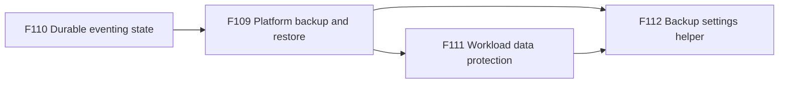
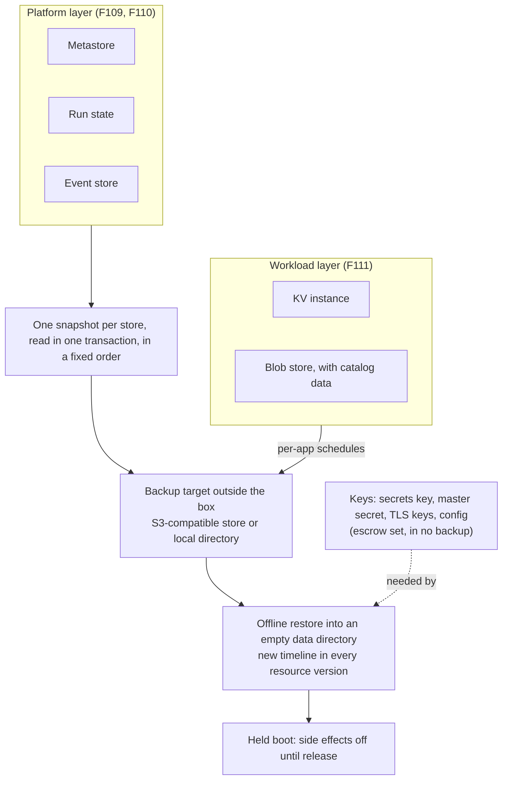

# FEAT-0009: Disaster recovery — back up and restore the platform and the apps' data

- **Status**: Active (living document — the tracking table updates as ADRs progress)
- **Date**: 2026-10-07
- **Deciders**: green-0-rabbit
- **Defines**: a **disaster-recovery epoch**: a way to back up the platform's own state and the data of the apps that
  run on it to a place outside the box, and to bring both back after a lost disk, a lost host or a bad release,
  without repeating what already happened. Positioned alongside the other additive epochs (FEAT-0003 to FEAT-0010);
  **not** part of v1.1 (FEAT-0001), whose KV backup row (F36) it builds on.

## Initial need

funcd keeps its state in several stores on one box: the metastore, the workflow run state, the dead-letter queue, the
KV instance and the blob store. Some keys live outside every store. Today:

- only the KV instance has a backup ([ADR-0067](../adr/0067-kv-opt-in-dr-backup.md), opt-in and off by default;
  [ADR-0195](../adr/0195-kv-backup-delete-records.md) makes every delete reach it), and nothing restores it in
  production;
- the metastore, the run state, the dead-letter queue and the blob store have no backup;
- a metastore restored from an older copy hands out resource versions that clients already hold, so a stale client can
  overwrite newer data without a conflict;
- a restored platform would resume work from records that are older than the real world: a workflow run would repeat a
  step that already ran, and a blob event would fire again for an object that was already handled;
- the keys that open the backups, such as the secrets key, live outside every store, so a backup alone cannot rebuild
  the platform;
- an app cannot back up its own data on its own schedule.

Other platforms split this in two layers with two owners: an etcd snapshot is separate from Velero, and Cloud Foundry's
BBR leaves service data out. The goal of this epoch is the same split for funcd. The operator backs up and restores the
platform, and each app owner backs up and restores the data of the app. The restore is the hard part: it must not
resume old work by itself, and it must not hand an old client a way to overwrite newer data.

## How this document works

This file captures **what** this capability set must contain and **why**. The **how** lives in ADRs (`docs/adr/`,
process in [ADR-0000](../adr/0000-adr-process.md)): every feature maps to one or more ADRs, and no implementation
detail is decided here. The design was refined with the decider from 2026-10-05 to 2026-10-07. Until the ADRs are
drafted, its source is the [design report](../reports/platform-disaster-recovery-design.md), which holds the research,
the proposals, the fourteen decided questions, the ten ADRs this epoch needs and their dependencies. The build order is
computed in the [delivery plan](../roadmap/dr-delivery-plan.md). The sections after the feature table summarise the
report. They are illustrative and non-normative: when an Accepted ADR disagrees with them, the ADR wins and this
document is updated to match. Feature status: `idea → adr → accepted → reviewing → implemented`.

## Features

Build order follows the dependencies. F110 needs no backup and can land first. F109 builds on F110, because a restored
platform must hold the eventing state together with the rest. F111 builds on F109, which fixes the backup rules that
every store follows. F112 builds on F109 and F111.

| # | Feature | Builds on | ADR(s) | Status |
|---|---|---|---|---|
| F109 | **Platform backup and restore**: the platform's own state (its resources, platform records, workflow run records and dead letters) is backed up on a schedule to a target outside the box, encrypted, and an operator restores it into an empty data directory after a lost disk, a lost host or a bad release, to a point before the damage. A restored platform starts held: its resources can be read and checked, but timers, sensors, event sources, workflow runs, dead-letter delivery and App rollouts stay off until the operator releases them. A client that holds a resource version from before the restore can no longer overwrite newer data. The keys that open the backups stay outside every backup, and a restore says which key it needs. An automatic snapshot before every upgrade gives a way back after a bad release, and a platform that keeps crashing starts on the last good copy, held. **Why**: the platform holds everything an app needs to run again, and today one lost disk or one bad release ends it. A restore that resumes old work by itself is worse than no restore, because it repeats side effects in the real world. | F110 · [ADR-0006](../adr/0006-store-database-layer-port.md)/[ADR-0065](../adr/0065-metastore-badger-engine.md) (the metastore) · [ADR-0007](../adr/0007-blob-storage-layer-port.md) (the blob port) · [ADR-0094](../adr/0094-workflow-engine-core.md) (the run state) · [ADR-0195](../adr/0195-kv-backup-delete-records.md) (KV deletes reach the backup) | — | idea |
| F110 | **Durable eventing state**: everything that eventing must remember across a restart, such as the dead letters and the list of blob objects that already fired events, lives in one store of its own that the platform backup covers. **Why**: that list sits today in the KV instance, which a different backup and a different restore point cover than the runs it started, so a restore can lose an event without a trace. | [ADR-0118](../adr/0118-eventing-dead-letter-queue.md) (the dead-letter store) · [ADR-0119](../adr/0119-object-store-eventsource.md)/[ADR-0157](../adr/0157-blob-event-seen-list.md) (the blob seen list) | — | idea |
| F111 | **Workload data protection**: an app backs up and restores its own data on its own schedule: its KV stores, its buckets and its catalogs, to a target of its choice, encrypted. A restore goes into a new name by default and the app owner swaps it in; restoring in place needs an administrator and takes an export first. The namespace is the permission boundary, and a backup outlives the schedule and the app that made it. The blob store itself can live on an S3-compatible target or on a local directory, and the KV backup follows the same rules as the platform backup. **Why**: the platform backup protects the platform, not the data of the apps on it. Apps need their own recovery points, per-app rollback and an independent copy, owned by the app owner. | F109 · [ADR-0067](../adr/0067-kv-opt-in-dr-backup.md)/[ADR-0195](../adr/0195-kv-backup-delete-records.md) (the KV backup) · [ADR-0086](../adr/0086-catalog-query-provider-ducklake-duckdb-quack.md) (the catalog) · [ADR-0007](../adr/0007-blob-storage-layer-port.md) · [ADR-0170](../adr/0170-owner-garbage-collector.md) (owner deletion) · the Cron decision of the Apps epoch (FEAT-0010) | — | idea |
| F112 | **Backup settings helper in funcdctl** (later): an operator or an agent states the recovery objectives (how much data may be lost, how long a recovery may take, how long copies are kept) and funcdctl proposes the matching backup settings or writes them, checking them with the same rules that the daemon applies at start. It can say that a target recovery time is impossible; only a restore drill proves that one is met. **Why**: the objectives are the architect's plan and live outside the platform. Turning them into intervals and retention by hand is error-prone. | F109, F111 | — | idea |

## How it lands on funcd (high level)

The platform keeps its state in separate stores, one per service. A backup reads each store in one transaction, in a
fixed order, and writes numbered, immutable, encrypted copies to a target outside the box: an S3-compatible store or a
local directory. The keys that open the copies stay in an escrow set that no backup contains. A restore is an offline
command. It loads the copies into an empty data directory, starts a new timeline so that old resource versions
conflict, and boots the platform held. The operator checks the platform and releases it. App owners protect their own
data with schedule resources in their namespace, and those backups go to a target the owner chooses.

## Capability map — reuse vs. new

| Component | Role for disaster recovery | Status | Feature |
|---|---|---|---|
| Metastore and its Badger engine ([ADR-0006](../adr/0006-store-database-layer-port.md), [ADR-0065](../adr/0065-metastore-badger-engine.md)) | holds every resource; gains a snapshot capability and a timeline in every resource version | exists; capability new | F109 |
| Run-state store ([ADR-0094](../adr/0094-workflow-engine-core.md)) | holds the workflow run records; backed up and restored as held evidence | exists; backup new | F109 |
| Dead-letter store ([ADR-0118](../adr/0118-eventing-dead-letter-queue.md)) | becomes the event store: holds the dead letters and the blob seen lists | exists; extended | F110 |
| Blob seen list ([ADR-0119](../adr/0119-object-store-eventsource.md), [ADR-0157](../adr/0157-blob-event-seen-list.md)) | moves from the KV instance into the event store | exists; moves | F110 |
| KV instance backup ([ADR-0067](../adr/0067-kv-opt-in-dr-backup.md), [ADR-0195](../adr/0195-kv-backup-delete-records.md)) | incremental export with delete records; joins the common backup rules | exists; common format new | F111 |
| Blob port ([ADR-0007](../adr/0007-blob-storage-layer-port.md)) over `gocloud.dev/blob` | reads and writes the targets; gains a create-if-absent option | exists; one option new | F109 |
| Backup target | an S3-compatible store or a local directory, checked at start | new | F109, F111 |
| Backup manifests | numbered, immutable records of each backup, with its timeline, format and key | new | F109 |
| Backup encryption and the escrow set | client-side encryption to recipients; the secrets key, the master secret, the TLS keys and the config kept outside every backup | new | F109 |
| Platform config (`funcdconfig.yaml`) | `backup:` keys with defaults, validated at start by the loader that funcdctl reuses | new keys | F109, F112 |
| Restore command | offline restore into an empty data directory; restore points; a version rule | new | F109 |
| The hold | one platform-wide hold stops timers, sensors, event sources, workflow runs, dead-letter delivery and, once Apps exist, App rollouts until release | new | F109 |
| `BackupSchedule`, `Backup` and `Restore` resources | an app's schedule, run records and restore requests, with namespace permissions | new | F111 |
| Admission and authorization ([ADR-0063](../adr/0063-admission-framework.md), [ADR-0074](../adr/0074-cedar-authorization-resource-access.md)) | check and authorize the workload resources | exists | F111 |
| Owner garbage collector ([ADR-0170](../adr/0170-owner-garbage-collector.md)) | deletes owned objects; a `Backup` is not deleted with its schedule or its App | exists; no cascade for a `Backup` | F111 |
| Catalog engine ([ADR-0086](../adr/0086-catalog-query-provider-ducklake-duckdb-quack.md)) | its durable state lives in blob and is copied in a fixed order | exists; copy order new | F111 |
| Cron decision of the Apps epoch | one cron implementation for timers and `BackupSchedule` | new, decided there | F111 |
| `funcdctl backup plan` | turns recovery objectives into settings and checks them | new | F112 |

## Rules at a glance (illustrative, non-normative)

| Topic | Rule | Feature |
|---|---|---|
| Layers | the operator owns the platform backup; the app owner owns the app's data backup | F109, F111 |
| Objectives | the ADRs fix no numbers; each setting is a config key with a default; the daemon checks the settings at start; a recovery time is not a key | F109, F112 |
| Cut | each store is read in one transaction, and the stores in a fixed order: event store, metastore, run state | F109 |
| Version | every resource version carries a random timeline, new at the store's first start and at every restore; a version from another timeline conflicts | F109 |
| Format | numbered, immutable manifests; a failed start-up check stops the backup unless `singleWriter: true` is set | F109 |
| Targets | S3-compatible stores and the local file system | F109, F111 |
| Credentials | the backup key can put and list but not read or delete; the restore key is separate and held by the operator | F109 |
| Encryption | on whenever a target is set; a backup that would carry plaintext Secrets is refused; the keys stay outside every backup | F109 |
| Restore | offline, into an empty data directory, from the same or an older minor version; the platform boots held | F109 |
| Hold | one platform-wide hold; per-kind pause flags stay as an operator tool | F109 |
| Evidence | run records and dead letters come back as evidence and are never resumed by themselves | F109, F110 |
| Blob events | replay by default after the release; skipping ahead is an explicit choice per source | F109, F110 |
| Registry | outside the scope; images are pinned by digest and Functions wait until they exist | F109 |
| Event store | the dead-letter store, extended to hold the blob seen lists | F110 |
| ConfigMaps and Secrets | inside the platform snapshot; an operator restores them object by object | F109 |
| Workload | the namespace is the permission boundary; a restore goes into a new name; in place needs an administrator and an export first | F111 |

## Exit criterion

The epoch is complete when a drill restores a platform and an app's data on a new host from the target and the escrow
set alone, nothing repeats that the restore point had already finished, and each feature passes its checks:

- **F110**: the dead letters and the list of fired blob objects live in one store of their own; moving the lists makes
  no object fire twice; a restart on a file-based store keeps them.
- **F109**: with a target configured, a backup runs on schedule and is encrypted; a failed start-up check or a missing
  key stops the backup and says why; an operator restores into an empty data directory after a lost disk and the
  platform boots held, with every resource, run record and dead letter of the last backup; a client that holds a version
  from before the restore gets a conflict instead of overwriting; the release turns the held parts on; an upgrade first
  snapshots the platform, and a platform that keeps crashing starts on the last good copy, held.
- **F111**: an app owner backs up a KV store, a bucket and a catalog on a schedule, restores into a new name and swaps
  it in; the backups of a deleted App stay until their time to live; the blob store runs on an S3-compatible target and
  a backup of it restores; the KV backup follows the same rules as the platform backup.
- **F112**: from objectives, funcdctl prints the settings; it says when a recovery time is impossible; a hand-edited
  config that breaks a rule is refused at start by the same rule.

## Out of scope (tracked elsewhere)

- **The OCI registry**: funcd does not manage it; a Function stays `NotReady` until its image is there.
- **A consistent cut of an app's stores**: how an app's KV stores, buckets and catalogs are cut together is discussed
  later, together with the lifecycle hooks of the Apps epoch (FEAT-0010, F117).
- **The SQL service**: the backup and restore of rqlite data belong to the rqlite service ADRs; restoring one app out
  of the shared database comes later.
- **High availability and replication**: a replica is not a backup, and multi-node is a V2 topic (FEAT-0002).
- **Recovery to any moment between two backups**: copies are snapshots; there is no write-ahead log.
- **Online restore into a running platform**: a restore is offline.
- **Key management services** for the secrets key (a KMS or OpenBAO driver): they come later behind the existing
  encryptor seam.
- **Step idempotency keys** for workflow steps: an optional topic of the workflow engine, not decided here.

## Open questions

| Question | Decided in |
|---|---|
| How an app's stores are cut together (lifecycle hooks or the backup API) | the app-level consistency discussion, with FEAT-0010 F117 |
| The cron syntax and time zone of `BackupSchedule` | the Cron ADR of the Apps epoch |
| Whether in-flight Sensor firings and the retry queue become durable in the event store | the event store ADR |
| The event store's name and directory, and the move of the existing seen lists | the event store ADR |
| Whether "restore and held boot" splits into two ADRs | when it is drafted, if it passes 250 lines |
| The rqlite backup mode and the per-app restore | the rqlite service ADRs |
