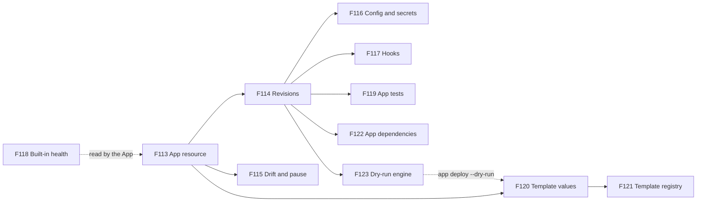
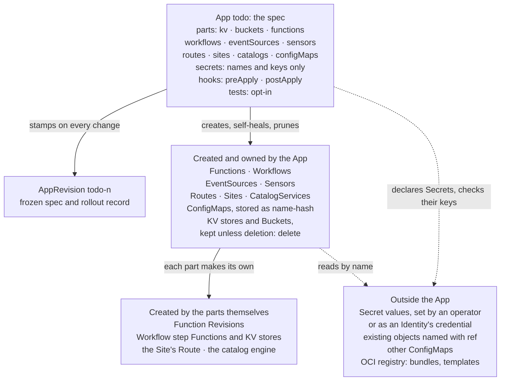
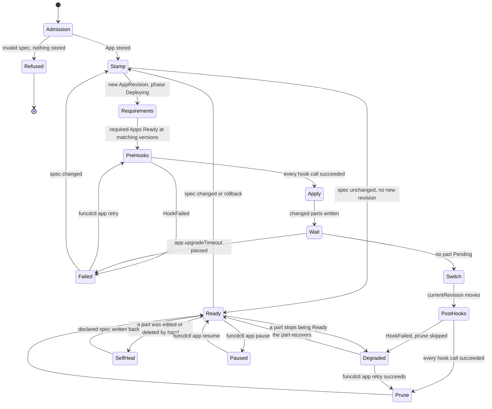
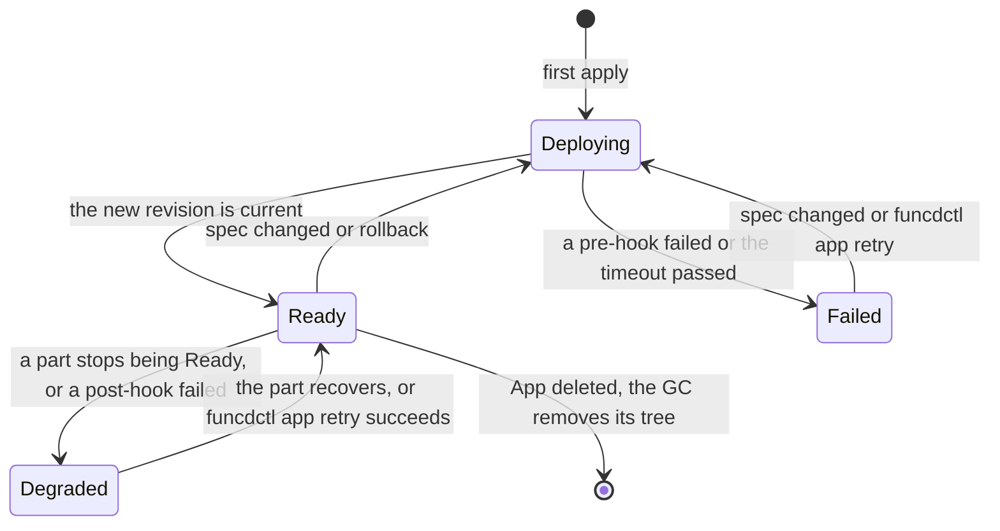
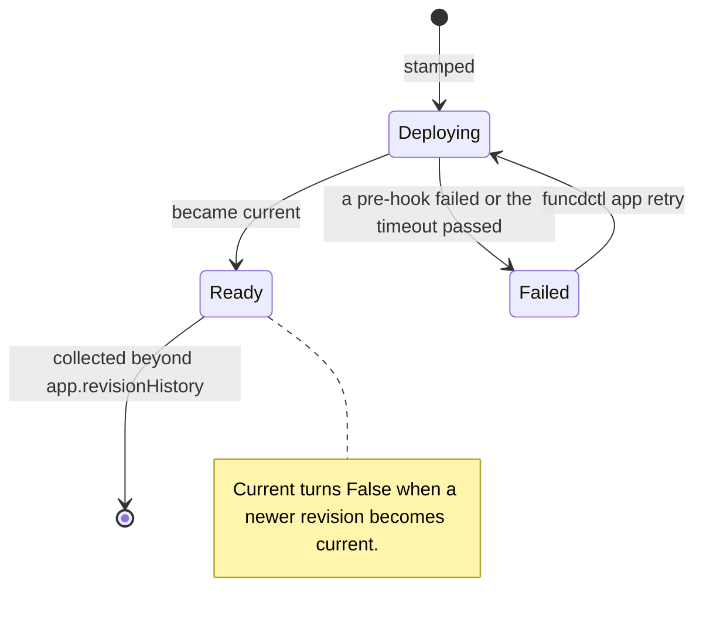
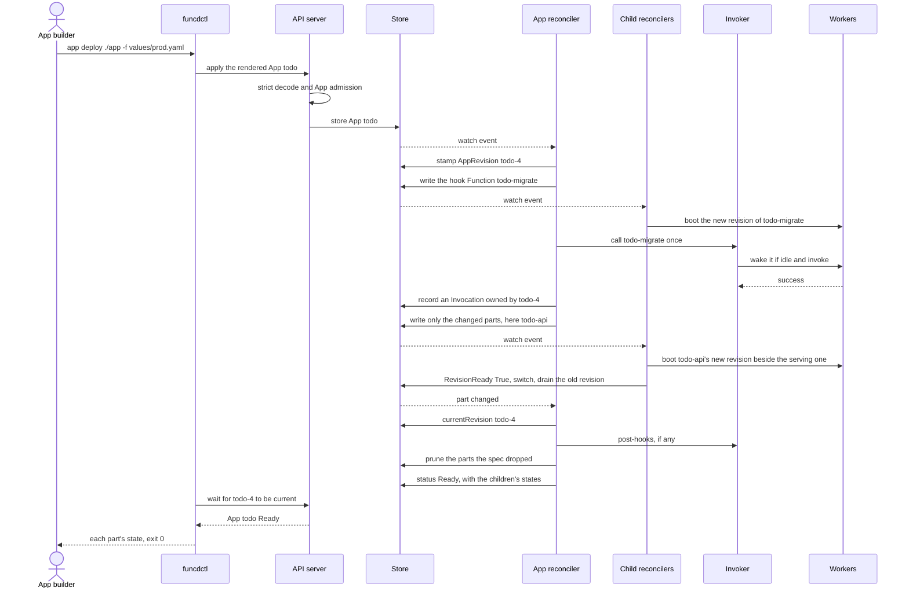
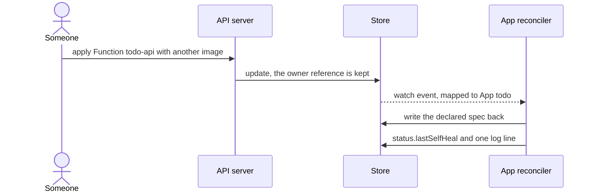

# FEAT-0010: Apps — many resources declared, deployed and versioned as one unit

- **Status**: Active (living document — the tracking table updates as ADRs progress)
- **Date**: 2026-10-07
- **Deciders**: green-0-rabbit
- **Defines**: an **Apps epoch**: funcd's built-in operator for user apps. One `App` resource declares every part
  of an application, and the platform installs, upgrades, self-heals, tests and removes those parts as one unit.
  Positioned alongside the other additive epochs (FEAT-0003 to FEAT-0008); **not** part of v1.1 (FEAT-0001).

## Initial need

A real app on funcd is several resources: Functions, a Workflow and its Sensor, a Site, a CatalogService and its
Bucket, KV stores, Routes and ConfigMaps. Today they ship as one multi-document file, which `funcdctl apply -f`
applies in order. Nothing knows that these resources belong together:

- the app as a whole has no version and no rollback;
- an upgrade never removes what the new version dropped;
- no single status says whether the app works;
- the same app cannot be installed twice with different settings;
- the work that goes with a deployment, such as a migration before an upgrade, is done by hand.

A `ResourceGroup` groups resources for a delete ([ADR-0170](../adr/0170-owner-garbage-collector.md)), but it carries
no version and no status. Kubernetes users solve this with Helm charts and operators. funcd needs its own answer, and
most of it already exists: a Workflow declares its step Functions and KV stores inline and creates them
([ADR-0094](../adr/0094-workflow-engine-core.md), [ADR-0096](../adr/0096-engine-native-builtin-steps.md)), a Site
declares its Bucket and Route ([ADR-0139](../adr/0139-site-declarative-static-web-app.md)), and a Function keeps
immutable revisions and switches between them without downtime
([ADR-0143](../adr/0143-redeploy-by-revision-switch.md)). The goal of this epoch is a platform that stays
self-contained and batteries included, and that a person or an AI agent can manage directly.

## How this document works

This file captures **what** this capability set must contain and **why**. The **how** lives in ADRs (`docs/adr/`,
process in [ADR-0000](../adr/0000-adr-process.md)): every feature maps to one or more ADRs, and no implementation
detail is decided here. The design was refined with the decider on 2026-10-06 and 2026-10-07. Until the ADRs are
drafted, its source is the [App design note](../reports/app-design.md), which holds every decision, scenario and
contract. The sections after the feature table summarise that note. They are illustrative and non-normative: when
an Accepted ADR disagrees with them, the ADR wins and this document is updated to match. Feature status:
`idea → adr → accepted → reviewing → implemented`.

## Features

Build order follows the dependencies. F113 lands first, and F114 builds on it. F115 needs only F113; F116, F117 and
F119 need both. F118 needs no App and can land at any time; the App reads its results once both exist. F120 and then
F121 can start once F113 has fixed the App's shape. F122 needs F113 and F114. F123 needs F113 and F114 for an App's plan,
and F120's dry run uses it.



| # | Feature | Builds on | ADR(s) | Status |
|---|---------|-----------|--------|--------|
| F113 | **App resource: one unit for a whole app**: one namespaced `App` declares every part of an application in typed sections, the way a Workflow declares its step Functions and KV stores: Functions, Workflows, EventSources, Sensors, Routes, Sites, CatalogServices, KV stores and Buckets (ConfigMaps come with F116). Each part keeps its declared name and takes the App's namespace and resource group. An entry can instead name an existing object with `ref`, as a Workflow step names an existing Function; the App uses that object and never writes or deletes it. The platform checks the whole App when it is applied and refuses an inconsistent one before anything is stored: a repeated name, an invalid part, an unknown section, or two parts that would write one object. It then creates and updates the parts with platform rights, as a Workflow writes its steps, and each part's own reconciler still makes that part's children (a Workflow its step Functions, a Site its Route). The App reports one status: its phase and the state of every part. It is Ready when every part is Ready, and an idle, scaled-to-zero Function counts as ready. Deleting the App removes its whole tree, but data survives: a KV store or a Bucket is deleted only when its entry says so, and a kept store is used again through `ref`. An App installs into any namespace and resource group, and a Function of one App may use a store of another when a role allows it. **Why**: today the parts of an app are applied one file at a time, and nothing knows that they belong together or reports whether the app works. A person or an agent should read, check and change the whole app as one object. | [ADR-0094](../adr/0094-workflow-engine-core.md)/[ADR-0096](../adr/0096-engine-native-builtin-steps.md) (a Workflow declares and creates its parts) · [ADR-0139](../adr/0139-site-declarative-static-web-app.md) (a Site declares its Bucket and Route) · [ADR-0063](../adr/0063-admission-framework.md) (admission) · [ADR-0121](../adr/0121-declarative-referential-integrity-admission.md) (referential integrity) · [ADR-0015](../adr/0015-controller-engine.md) (controller framework) · [ADR-0170](../adr/0170-owner-garbage-collector.md) (owner garbage collector) · [ADR-0178](../adr/0178-a-workflow-adopts-only-its-own-kv-stores.md) (a Workflow adopts only its own KV stores) · [ADR-0174](../adr/0174-never-booted-revision-is-unknown.md) (a never-booted revision is unknown) | [ADR-0199](../adr/0199-app-resource.md) | accepted |
| F114 | **App revisions: safe upgrade, history and rollback**: the platform stamps every change to an App's spec as an immutable, read-only `AppRevision`, as it stamps a Function change as a Revision. The AppRevision also records how its rollout went. An upgrade writes only the parts whose spec changed, so the other parts keep running untouched, and each changed Function switches to its new revision by itself once that revision is ready. The new AppRevision becomes current only when every part is ready, and only then are the parts that the new version dropped removed. An upgrade that does not finish within the platform's timeout stops and is reported as failed; the previous revision stays current and keeps serving, and nothing rolls back by itself. The history lists every revision, and a rollback applies an earlier revision's spec as a new revision. The timeout and the number of revisions kept are platform settings. The App does not judge which component versions work together: the App builder, a person or an agent, pins compatible versions in the template that it publishes. **Why**: the decider requires immutable App revisions, as the platform keeps for Functions. An upgrade that fails halfway must not take the app down, and an operator must see what is deployed and be able to go back. | F113 · [ADR-0020](../adr/0020-function-contract-lifecycle.md)/[ADR-0172](../adr/0172-revision-integrity.md) (Function → Revision, the model) · [ADR-0143](../adr/0143-redeploy-by-revision-switch.md) (redeploy by revision switch) · [ADR-0190](../adr/0190-run-bound-to-its-revision.md) (a run stays bound to its revision) | — | idea |
| F115 | **Drift correction and pause**: the App behaves as an operator. When someone edits or deletes one of its parts by hand, the App writes the declared spec back at once (self-heal; F113's apply already does so on its next pass), writes one log line and records the last self-heal in its status, as a Site rewrites its Route. For deliberate manual work, such as a hot fix during an incident, an operator pauses the App. A paused App writes nothing (no apply, no removal and no self-heal) until it is resumed, and then the declared spec wins again. The App never writes back a Secret or an object that it names with `ref`. **Why**: the App must remain the truth about what runs, or an upgrade and a rollback act on a state that nobody declared. A person still needs a safe way to step in. | F113 · [ADR-0139](../adr/0139-site-declarative-static-web-app.md) (a Site rewrites its Route) · [ADR-0094](../adr/0094-workflow-engine-core.md) (a paused WorkflowRun) | — | idea |
| F116 | **App configuration and secret declarations**: an App defines its own configuration as ConfigMaps, and a change to that configuration rolls out like any other change: the Functions that use it get a new revision and switch, and a rollback brings the old values back. An App declares the Secrets it needs but never holds their values. Each declaration gives the Secret's name, the keys that the code reads and a description, so the App and its template document everything that an installer must provide. The values stay with the platform: an operator sets them, or an Identity's credential provides them. The App never creates, writes or rewrites a Secret. It refuses a part that uses a Secret it does not declare, and it holds a rollout, naming the missing Secret or key, until an operator provides it. **Why**: a Function reads its configuration only when a worker starts, so a changed ConfigMap reaches no running Function today. Secret values must never sit in an App, a template or git, but an installer, a person or an agent, still needs to know which secrets to provide. | F113 · F114 · [ADR-0057](../adr/0057-secret-injection-last-mile.md) (secret injection) · [ADR-0093](../adr/0093-function-configmap-consumption.md) (ConfigMap consumption) · [ADR-0135](../adr/0135-managed-identity.md) (an Identity's credential Secret) | — | idea |
| F117 | **App lifecycle hooks**: an App names Functions of its own to call once before its parts change (pre-apply: a schema migration, a backup before an upgrade) and once after the new version is current (post-apply: a data migration, a cache warm-up), on install, upgrade and rollback. A hook is one ordinary Function call with the usual handler context (KV, blob, invoke and log, scoped by the hook Function's own bindings), recorded as an Invocation. No Workflow or other engine sits in the path, so a failed hook is debugged like any Function call. A failed pre-hook stops the upgrade before any other part changes. A failed post-hook keeps the new version, holds the removal of dropped parts and marks the App degraded. A retry command calls the failed hooks again and resumes the rollout, so a hook must be safe to repeat. **Why**: deploying a service often needs a migration beside it, and the decider wants that work inside the platform, run by the App. A hook must not depend on another component that can itself be degraded. | F114 · [ADR-0109](../adr/0109-sensor-event-action-binder.md) (the Sensor's invoker) · [ADR-0033](../adr/0033-data-plane-serving-and-trigger-wake.md) (wake on call) · [ADR-0090](../adr/0090-mandatory-single-io-schema.md) (the input contract) | — | idea |
| F118 | **Built-in health for every part**: every part's health comes from the platform, with no code from the user. funcd checks liveness on every Function replica and restarts a replica that hangs. A Function's readiness also proves that its declared dependencies answer (its KV tables, blob prefixes, catalogs and link targets), without waking a scaled-to-zero target. The platform probes the KV engine and the blob storage, and every KV store and Bucket reflects the result. An App combines these states into its own. This changes the contract between funcd and the language shims, so new shim releases ship with it. **Why**: today funcd restarts a crashed worker but not a hung one, and it polls liveness only for pool workers. Ready proves that a handler loaded, not that the handler can reach what it needs. The decider wants health inherited from the shim, not written for each function. Every Function benefits, with or without an App. | [ADR-0142](../adr/0142-supervision-by-periodic-re-convergence.md) (supervision by periodic re-convergence) · [ADR-0174](../adr/0174-never-booted-revision-is-unknown.md) (a never-booted revision is unknown) · [ADR-0141](../adr/0141-repo-split-pyvvo-pinned-language-modules.md) (the shims as pinned language modules) | — | idea |
| F119 | **Opt-in App tests**: an App can list checks that prove it still behaves as intended: an HTTP request through the edge with its expected status, a Function call with an input, or a WorkflowRun. A command runs them on demand, as `helm test` does. The results are recorded on the current AppRevision, nothing runs the checks by itself, and a failed check changes nothing else. **Why**: the platform proves that each part is accepted and loaded, never that the app does its job, because no reconciler calls a handler with test input. The decider wants that proof to be explicit and opt-in, and separate from health. | F113 · F114 | — | idea |
| F120 | **App templates: values and rendering**: an App template is a directory of App fragments plus a values schema, so one definition installs many times with different settings. funcdctl renders it on the client into one App. The install values come from files kept in git; a JSON Schema types and checks them, with defaults and conditional requirements, and a value it does not declare is refused. Expressions use the platform's existing `${{ }}` engine, and a file can be included only when a condition holds. One command deploys, upgrades and downgrades an App from a template version and waits until the new revision is current or has failed; its dry run (F123) shows what a deploy would change and which hooks it would call, without writing anything. Another command deletes the App and reports which data stores stayed. The server never sees a template: the App that it receives is the source. **Why**: the same app is installed in several places (dev, prod, a second team, an end-to-end lane) with different settings, as with a Helm chart, and this must not add a template engine or a server-side render to the platform. A person or an agent should deploy, upgrade, downgrade and delete an app with one command each. | F113 · [ADR-0095](../adr/0095-reference-engine-typed-paths-predicates.md) (the goja `${{ }}` engine) · [ADR-0122](../adr/0122-funcdctl-yaml-manifest-native-contract-codegen.md) (`funcdctl.yaml`, a client file of the same kind) | — | idea |
| F121 | **App templates in an OCI registry, with pinned images**: the builder sets the version of every image the app runs, in one table of the template, as a package.json sets its dependencies: an exact version or an npm-style range such as `^1.0.0`. An install can change only the registry the images come from, through a value with a default. A lock command resolves each range to the highest matching version and records every image's exact version and digest in a lock file committed with the template, as npm's package-lock.json and Helm's Chart.lock do. Render, deploy and push use it, and push packs the template exactly as it is in git, so a tag moved later never changes what a template version or a commit installs. The template's version is its registry tag. A template is pushed to an OCI registry and deployed from it, as a Helm chart is, beside the function bundles and site files it references. The server still never pulls a template. The transfer speed of every artifact kind, templates included, is tracked under #820. **Why**: a template version is the unit of compatibility, so its builder, a person or an agent, must be able to publish image versions that were tested together. The registry must change from day one, because the end-to-end lanes run every image from a local OCI layout and a site may use its own registry. Ranges let a builder accept compatible patch releases without editing the template. | F120 · [ADR-0031](../adr/0031-oci-artifact-distribution-oras.md) (OCI artifacts) · [ADR-0035](../adr/0035-artifact-digest-resolution-at-revision.md) (an explicit digest is used as written) · [ADR-0139](../adr/0139-site-declarative-static-web-app.md) (`funcdctl push --site`, the precedent) | — | idea |
| F122 | **App dependencies (`requires`)**: an App declares the shared Apps it needs, in its namespace, each with an npm-style version range or with none, which accepts any version, such as a `billing` App that needs a `lakehouse` App at `^2.0.0`. Its rollout waits until every required App is Ready at a matching version: no part is written and no hook is called before that, and the upgrade timeout starts only then, so Apps still apply in any order. Admission refuses an upgrade or a rollback that takes a required App out of a range a dependent satisfies, the delete of an App that another App requires, and a requirement cycle; each refusal names the dependents. Both Apps show the link in their status. **Why**: a shared app, such as a lakehouse used by several services, is managed on its own. `ref` already lets an App use its objects and wait for them (ADR-0121), but nothing checks the shared app's version, and nothing stops an upgrade or a delete that breaks the apps using it. Template includes (Helm-subchart building blocks) and nested Apps were not chosen. | F113 · F114 · [ADR-0121](../adr/0121-declarative-referential-integrity-admission.md) (references wait; apply in any order) · [ADR-0064](../adr/0064-fn-to-fn-rpc-links.md) (link validity and deletion protection, the precedent) | — | idea |
| F123 | **Dry-run engine**: the platform can answer what a write would do without doing it. A create or an update sent as a dry run goes through the same decoding, validation and admission as a real one, and comes back with the object as it would be stored, or with the refusal; nothing is stored. For an App, the answer also carries the plan: the AppRevision that would be stamped, the parts that would be created, updated or pruned, and the hooks that would be called. `funcdctl apply --dry-run` and `funcdctl app deploy --dry-run` use it. **Why**: today a refusal shows only at the real write. `funcdctl apply` validates each document offline, but the checks that need the store run only on the server, such as a Bucket beyond its namespace's quota or a link to a Function that does not exist. A person or an agent should see a refusal, and what a deploy would change, before making the change. Every kind benefits, with or without an App. | F113 · F114 · [ADR-0063](../adr/0063-admission-framework.md) (the admission pipeline every write passes) · [ADR-0064](../adr/0064-fn-to-fn-rpc-links.md) and [ADR-0080](../adr/0080-s3-protocol-frontend-blob-substrate.md) (server-only refusals: link validity, the bucket quota) | — | idea |

## How it lands on funcd (high level)

An App is funcd's built-in operator for user apps. It is one namespaced resource that declares every part of an
application in typed sections, the way a Workflow declares its steps. funcd checks the parts when the App is
applied, creates them, reports one status, stamps an immutable AppRevision for each change, self-heals parts that
someone edits by hand, runs the App's hooks, removes what a new version dropped, and rolls back by revision. A
client-side template gives values and reuse across installs, and it can be pushed to an OCI registry like a Helm
chart.

- The App spec is the source; the server never pulls a template.
- A rollout writes only the parts whose spec changed; the other parts keep running.
- The App builder, a person or an agent, decides which component versions work together.



## Capability map — reuse vs. new

| Component | Role for the App | Status | Feature |
|---|---|---|---|
| `funcdctl app deploy` | renders a template version and applies it, then waits until the new revision is current or failed; deploys, upgrades and downgrades; `--dry-run` lists what it would change and writes nothing | new | F120 |
| `funcdctl app render` | prints the App a template renders, for a review | new | F120 |
| `funcdctl app delete` | deletes an App, waits until its tree is gone, and reports the stores it kept | new | F120 |
| goja (`internal/expr`, [ADR-0095](../adr/0095-reference-engine-typed-paths-predicates.md)) | evaluates the template's `${{ }}` expressions on the client; hooks do not use it | exists | F120 |
| `funcdctl app lock` | resolves every image's version or npm-style range and writes the exact version and digest of each into `app.lock` | new | F121 |
| `funcdctl push --template` | packs the template directory as it is, `app.lock` included, and pushes it as an OCI artifact tagged with its version; refuses a missing or stale lock | new | F121 |
| `Masterminds/semver/v3` | parses and matches npm-style version ranges; MIT, already in `go.mod` as an indirect dependency | exists, becomes direct | F121 |
| OCI registry | holds templates, function bundles and site bundles | exists, outside funcd | F121 |
| API server and admission ([ADR-0063](../adr/0063-admission-framework.md)) | decodes the App strictly and runs the App admission | exists; App admission new | F113 |
| Store, the metastore | holds the App, its AppRevisions and its parts; bumps a generation only when a `spec` changes | exists | F113, F114 |
| Controller framework ([ADR-0015](../adr/0015-controller-engine.md)) | runs the App reconciler and one watch per part kind | exists | F113, F115 |
| App reconciler | a materializer one level up: stamp, requirements, hooks, apply, wait, switch, prune, self-heal, status | new | F113 to F117, F122 |
| Child reconcilers | Function (revisions, the [ADR-0143](../adr/0143-redeploy-by-revision-switch.md) switch), Workflow materializer, KV store, Site, Route, CatalogService, EventSource, Sensor: each provisions its own children and reports Ready | exist | F113 |
| Invoker (activator, [ADR-0033](../adr/0033-data-plane-serving-and-trigger-wake.md)) | calls hook Functions once and wakes them when they are scaled to zero | exists | F117 |
| Workers and shims | run the Functions; the handler context gives `kv`, `blob`, `invoke` and `log` | exist; health checks extended | F117, F118 |
| Owner garbage collector ([ADR-0170](../adr/0170-owner-garbage-collector.md)) | deletes the App's tree; stores follow their `deletion` setting | exists; App pairs new | F113 |
| Platform config | `app.upgradeTimeout` (5m) and `app.revisionHistory` (10) | new keys | F114 |
| Dry run in the API server | runs decoding, validation and the admission pipeline on a write and stores nothing; returns an App's plan | new: funcd has no dry run today | F123 |

## Example: the to-do app (illustrative, non-normative)

The design note gives the full to-do App. Its project holds the template, the code and the front end:

```
todo/
├── app/                          the App template, pushed with funcdctl push --template
│   ├── app.yaml                  name, version, registry, images, valuesSchema, when per file
│   ├── app.lock                  written by funcdctl app lock: version and digest of each image
│   └── resources/                fragments of the App spec, merged at render
│       ├── store.yaml            kv: todo-store (retain), todo-cache (delete)
│       ├── files.yaml            buckets: todo-files
│       ├── api.yaml              functions and routes: todo-api on /api
│       ├── planner.yaml          functions: todo-planner
│       ├── migrate.yaml          functions: todo-migrate, called by the preApply hook
│       ├── plan.yaml             workflows: todo-plan
│       ├── schedule.yaml         eventSources and sensors: the hourly timer
│       ├── stats.yaml            functions and routes: todo-stats, when analytics is on
│       ├── lake.yaml             catalogs: todo-lake, when analytics is on
│       ├── web.yaml              sites: todo-web
│       ├── settings.yaml         configMaps: todo-settings
│       ├── secrets.yaml          secrets: todo-stripe-key, keys only, no value
│       ├── hooks.yaml            hooks: preApply calls todo-migrate
│       └── tests.yaml            tests: an HTTP check and a Function call, run on demand
├── values/                       install values, kept in git, never pushed
│   ├── dev.yaml
│   ├── e2e.yaml                  registry: a local OCI layout for the Venom lanes
│   └── prod.yaml
├── functions/                    code, pushed with funcdctl push
│   ├── api/
│   ├── planner/
│   ├── migrate/
│   └── stats/
└── web/dist/                     the front end, pushed with funcdctl push --site
```

The builder fixes every image version in `app.yaml`, and an install changes only the registry (F121):

```yaml
# app/app.yaml (excerpt)
name: todo
version: 1.2.0
registry: ${{ values.registry }}
images:
  api: todo-api:1.0.0
  planner: todo-planner:1.0.0
  migrate: todo-migrate:1.2.0
  stats: todo-stats:^1.0.0
  web: todo-web:1.0.0
valuesSchema:
  type: object
  required:
    - host
  properties:
    registry:
      type: string
      default: registry.example
    host:
      type: string
when:
  resources/stats.yaml: ${{ values.analytics.enabled === true }}
---
# values/e2e.yaml: a Venom lane pulls every image from a local OCI layout
registry: oci-layout:///mnt/funcd-deps/apps
host: todo.e2e.test
```

`funcdctl app lock ./app` resolves every image and writes `app/app.lock`, which is committed with `app.yaml`:

```yaml
images:
  api:
    requested: todo-api:1.0.0
    version: 1.0.0
    digest: sha256:4f1c…
  stats:
    requested: todo-stats:^1.0.0
    version: 1.0.3
    digest: sha256:7d2a…
```

Rendered with this lock and `values/e2e.yaml`, the API Function's image is
`oci-layout:///mnt/funcd-deps/apps/todo-api:1.0.0@sha256:4f1c…`, from the directory and from the pushed template
alike.

Secrets are declared in `resources/secrets.yaml` with their names and keys, so the template documents what the app
needs (F116). A ConfigMap carries its data, because it is not sensitive. A Function names both by their declared
names:

```yaml
# resources/secrets.yaml: what the app needs, never a value
secrets:
  - name: ${{ app.name + "-stripe-key" }}
    description: Stripe keys for payments and webhooks
    keys:
      - STRIPE_API_KEY
      - STRIPE_WEBHOOK_SECRET
---
# resources/settings.yaml
configMaps:
  - name: ${{ app.name + "-settings" }}
    data:
      TZ: Europe/Paris
---
# resources/api.yaml (excerpt)
functions:
  - name: ${{ app.name + "-api" }}
    image: ${{ images.api }}
    secrets:
      - ${{ app.name + "-stripe-key" }}
    config:
      - ${{ app.name + "-settings" }}
```

Outside the App, an operator sets the values with an ordinary Secret. Until that Secret exists with both declared
keys, the App waits with `SecretNotFound` or `SecretKeyMissing`.

```yaml
apiVersion: funcd.io/v1alpha1
kind: Secret
metadata:
  name: todo-stripe-key
  namespace: team-a
  resourceGroup: todo
spec:
  type: Opaque
  data:
    STRIPE_API_KEY: ZXhhbXBsZS12YWx1ZQ==
    STRIPE_WEBHOOK_SECRET: ZXhhbXBsZS13ZWJob29r
```

An App reports one status, and each line of it points to a part that has its own status, logs and traces (F113):

```yaml
status:
  phase: Degraded
  currentRevision: todo-3
  conditions:
    - type: Ready
      status: "False"
      reason: ChildNotReady
      message: "Function/todo-api: Restarting"
  children:
    - kind: Function
      name: todo-api
      state: Pending
    - kind: Function
      name: todo-stats
      state: NotStarted
  lastSelfHeal:
    kind: Function
    name: todo-api
    at: "2026-10-07T12:03:10.000Z"
```

A person or an agent follows one path: `funcdctl describe app todo`, then `funcdctl app history todo`, then the
first part that is not Ready, with `funcdctl describe` and `funcdctl logs`. A failed hook names its Invocation.

A shared App (F122): `billing` uses the catalog of the `lakehouse` App and needs version 2 of it.

```yaml
# App billing (excerpt)
spec:
  version: 1.3.0
  requires:
    - app: lakehouse
      version: ^2.0.0
  catalogs:
    - ref: lake
---
# while lakehouse is at 1.9.0
status:
  phase: Deploying
  conditions:
    - type: Ready
      status: "False"
      reason: RequirementNotMet
      message: "App/lakehouse is 1.9.0; billing needs ^2.0.0"
```

## The lifecycle (illustrative, non-normative)

### One rollout, as the App reconciler runs it (F114, F115, F117, F122)



A paused App writes nothing: no apply, no prune and no self-heal. The diagram shows the pause from `Ready` only, to
keep it readable.

### App phases (F113, F114)



### AppRevision phases (F114)



### An upgrade with a pre-hook (F114, F117)



### A part edited by hand (F115)



## Rules at a glance (illustrative, non-normative)

| Topic | Rule | Feature |
|---|---|---|
| Shape | typed sections; an entry is `name` plus the kind's own spec, or `ref: <name>` for an existing object | F113 |
| Names | parts keep their declared names; a template adds a prefix when two installs share a namespace | F113, F120 |
| Admission | refuses a repeated name, an invalid entry, an unknown section, and two parts that would write one object | F113 |
| Readiness | a Function counts by `RevisionReady`; a Function that never started counts as settled (`NotStarted`) | F113 |
| Data | stores are kept unless `deletion: delete`; a kept store is used again through `ref` | F113 |
| Rights | parts are written with platform rights, as a Workflow writes its steps | F113 |
| Revisions | the platform stamps an AppRevision per spec change; a rollback is a new revision with the old spec | F114 |
| Rollout | only changed parts are written; each Function switches by itself when its new revision is ready | F114 |
| Failure | after `app.upgradeTimeout` the revision is `Failed` and the old one stays current; no automatic rollback | F114 |
| Prune | runs only after the switch, and is skipped when a post-hook fails | F114, F117 |
| Drift | a part edited or deleted by hand gets its declared spec back at once; `spec.paused` stops every write | F115 |
| Config | a ConfigMap that the App defines is stored as `<name>-<hash>`, so a change rolls the Functions that use it | F116 |
| Secrets | declared in the App (name, keys, description); the platform manages the values; a missing Secret or key holds the rollout; the App never writes a Secret | F116 |
| Hooks | `preApply` and `postApply` call Functions of the App once per rollout; `funcdctl app retry` calls failed ones again | F117 |
| Health | built in: liveness on every replica, a dependency check in the shim, one probe of the KV engine and blob storage | F118 |
| Tests | `spec.tests` runs only with `funcdctl app test` | F119 |
| Dry run | goes through decoding, validation and admission like a real write, stores nothing, and returns an App's plan | F123 |
| Requirements | `requires` names shared Apps, each with an optional npm-style range (none accepts any version); the rollout waits until they are Ready at a matching version; an upgrade out of a dependent's range, the delete of a required App and a cycle are refused | F122 |
| Templates | rendered on the client; values only from `-f` files, refused when undeclared; the server never pulls a template | F120 |
| Images | set by the builder in the template's `images` table, as an exact version or an npm-style range; only the registry is a value; `app.lock` holds the resolved version and digest, and render, deploy and push use it; the push tag is the template version | F121 |

## Exit criterion

The epoch is complete when the to-do app of the design note installs, upgrades, heals, tests and goes away as one
object, by hand or by an agent, and each feature passes its scenarios (named in the design note):

- **F113**: the App installs with every part and reports one `Ready` status (`app-install`); an inconsistent App is
  refused at apply and nothing is stored (`app-admission-refuses`, `app-shared-writer-refused`); a part that the App
  does not own stops it (`app-child-not-owned`); a `ref` waits for its object and is never written
  (`app-ref-waits`, `app-ref-kept-store`); an idle Function keeps the App Ready (`app-idle-function-stays-current`,
  `app-scale-to-zero-not-started`); a delete removes the tree and keeps the retained stores
  (`app-delete-collects-tree`).
- **F114**: an unchanged re-apply stamps nothing (`app-reapply-same-spec`); an upgrade writes only the changed parts
  (`app-upgrade`, `app-one-part-changes`); dropped parts go only after the switch (`app-prune-after-current`); a
  broken upgrade keeps the old revision serving (`app-failed-upgrade-keeps-serving`); a rollback is a new revision
  (`app-rollback`).
- **F115**: a hand edit is reverted within seconds and recorded (`app-drift-self-healed`); a paused App keeps a hot fix
  (`app-paused-keeps-hotfix`).
- **F116**: a declared Secret holds the rollout until it is complete (`app-secret-declared`); an undeclared one is
  refused (`app-secret-undeclared-refused`); a config change rolls its Functions and a rollback brings it back
  (`app-config-change-rolls`); no secret value appears in an App, an AppRevision, a status or a log.
- **F117**: a pre-hook migration runs before any other part changes (`app-pre-hook-migrates`); a failed hook stops
  or degrades the rollout and a retry resumes it (`app-pre-hook-fails-then-retry`, `app-post-hook-fails`).
- **F118**: a hung replica is restarted (`app-hung-worker-restarted`); a revision that cannot reach its declared
  dependencies never becomes current, and no check wakes a scaled-to-zero target (`app-dependency-check`).
- **F119**: tests run only on demand and change nothing else (`app-test-on-demand`).
- **F120**: the to-do template renders to the App of the design note (`app-render-matches`); an undeclared value or
  an image outside the `images` table is refused (`app-render-refuses`); a deploy waits and reports, and a delete
  reports the stores it kept (`app-deploy-waits`, `app-delete-reports`).
- **F121**: the lock pins every image, push packs it unchanged, and a moved tag changes nothing
  (`app-template-pinned`); a range resolves to the highest matching version, and a stale lock is refused
  (`app-template-range`); the registry value points the App at a local OCI layout (`app-registry-value`).
- **F122**: a dependent waits for its required App and writes nothing until then (`app-requires-waits`,
  `app-requires-version`, `app-requires-any-version`); an upgrade out of a dependent's range, the delete of a required
  App and a cycle are refused (`app-requires-upgrade-refused`, `app-requires-delete-refused`,
  `app-requires-cycle-refused`).
- **F123**: a dry run returns the same refusal as the real write and stores nothing (`apply-dry-run-refused`); an
  App's dry run lists the AppRevision, the parts and the hooks, and writes nothing (`app-deploy-dry-run`).

## Out of scope (tracked elsewhere)

- **Pulling a bundle or a template on the server**: the App spec is the source; the server never pulls a template.
- **Secret values in an App**: the App declares the Secrets it needs, and the platform manages their values. Live
  secret rotation belongs to the secrets work ([ADR-0057](../adr/0057-secret-injection-last-mile.md), V2).
- **Judging which component versions work together**: the App builder's job, through the template version that it
  publishes.
- **Switching the whole App at once** (an app-wide blue-green): parts switch one by one.
- **Automatic rollback**: a failed upgrade stays visible, and a rollback is an explicit act.
- **Hooks through Workflows or goja scripts**, and hooks before a delete: a delete hook would need finalizers, which
  funcd does not use ([ADR-0170](../adr/0170-owner-garbage-collector.md)).
- **Apps across namespaces**: the namespace stays the tenancy boundary.
- **App backups**: the `backupSchedules` section and the App scope are reserved for the DR workload-backup ADR,
  which writes them once the `BackupSchedule` kind exists.
- **Cron schedules for timers**: their own decision, outside this epoch. The DR plan's `BackupSchedule` needs cron for
  its `schedule` field, so that ADR comes before the DR workload-backup ADR.
- **Images from two registries in one template**: not yet; a board card tracks it.
- **Template includes and nested Apps**: a building block copied into each App (a Helm subchart) and an App holding
  child Apps were not chosen for F122 (2026-10-07).
- **Requirements across namespaces**: an App requires only Apps of its own namespace.
- **A platform-side registry mapping** (a Nexus mirror for every artifact pull): skipped for now. funcd redirects
  only runtime images today (`runtime.containerd.imagePrefix`).
- **Duration strings across the API**, such as `10m` and `500ms`, with the millisecond as the smallest unit:
  [ADR-0194](../adr/0194-api-duration-strings.md) (accepted) makes them the API format with a clean break, so an
  integer is refused. The App examples use them, and their times follow
  [ADR-0196](../adr/0196-utc-millisecond-timestamps.md) (RFC3339 UTC with milliseconds).

## Open questions

| Question | Decided in |
|---|---|
| Finer RBAC: do parts get written with the last writer's rights or with a named Identity's? | the IAM work (FEAT-0008), when it adds per-kind roles |
| Sections for IAM kinds (Identity, Role, RolesAssignment, Policy, EgressPolicy) | F113, when an app needs them |
| A start-time check that `app.upgradeTimeout` is longer than `runtime.bootTimeout` | the F114 ADR |
| A platform client in a hook's context: the DR plan's API lets a Function create a `Backup`, and a hook needs a client to call it | F117, with the DR backup API |
| A hook point around a backup or a restore, for the DR plan's deferred app-level consistency | F117, with that DR work |
| A hook before a delete | F117, later, if a case needs it |
| Health settings: the liveness period, the dependency-check timeout, the probe interval | the F118 ADR, which also changes the shim contract |
