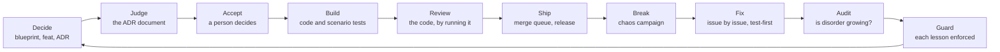

# How funcd is built

funcd is written mostly by AI agents, under a fixed method. A person decides what to build, and agents do the
rest: they draft and judge the design, build it, review it, attack the result on purpose, fix what breaks, and
audit whether the fixes made the code worse. Every artifact passes an independent gate, every review is recorded,
and every process failure becomes a guard that stops it from happening again.

This page describes the method as it is practiced in this repository, so that it can be reused in other
projects. The method has no name yet; candidates are listed at the end. The authoritative rules stay where they
are: [ADR-0000](../adr/0000-adr-process.md) for the design process and [CLAUDE.md](../../.claude/CLAUDE.md) for
the working agreement. This page explains how the parts fit together.

## Principles

- **Documents drive the code.** Nothing is built without an accepted decision record (an ADR), and code must
  conform to its ADR's contracts.
- **The maker never checks its own work.** An independent agent judges each ADR, reviews each implementation and
  each fix, and audits each batch of changes.
- **Decisions are frozen once accepted.** A changed decision is a new ADR that supersedes the old one; history is
  never rewritten.
- **Derived artifacts are computed.** The roadmap's build waves and critical path come from data
  ([`v1-plan.json`](../roadmap/v1-plan.json)), never from a hand-drawn graph.
- **The system is attacked on purpose.** A chaos campaign looks for defects before users do, and every finding
  becomes an issue in a fixed shape.
- **Every fix is proven.** A regression test fails without the fix and passes with it.
- **The agents are measured.** Every review is recorded in a ledger, and each model gets a scorecard.
- **A lesson becomes a guard, not a rule.** A process failure is fixed with a hook, a lock, a check or a test that
  enforces it.
- **Every loop has a stopping rule.** Fixing produces new findings, so each round raises the bar for what gets
  fixed until the chain converges.
- **Safe, high-value iterations beat speed.** A round that creates more issues than it fixes is a loss, so a run
  that changes code uses at most five agents at once.

## 1. Decide: documents drive the code

Four document layers sit above the code, and each answers one question:

| Layer | Path | Answers | Changes |
|---|---|---|---|
| Blueprint | [blueprint.md](../../blueprint.md) | What the platform is: the target architecture | Living; the newest accepted ADR wins over it |
| Feature version | [docs/feat/](../feat/) | What a version must contain, and why | Living; one row per feature (`Fxx`) tracks its status |
| ADR | [docs/adr/](../adr/) | How one decision is made, with its contracts | Frozen once `Accepted` |
| Roadmap | [docs/roadmap/](../roadmap/) | In what order ADRs get built | Computed from `v1-plan.json` |

A feature version is split into features, and each feature into one or more ADRs. Each ADR names the feature row
it realizes (`Realizes: FEAT-NNNN/Fxx`), and the row's status follows the ADR's status. An ADR moves forward only:

`Draft → Proposed → Accepted → Reviewing → Implemented`, or `Superseded by ADR-NNNN`.

Each step is a skill in [.claude/skills/](../../.claude/skills/):

| Step | Skill | What it does |
|---|---|---|
| Plan | `roadmap-planner` | Sequences a version's ADRs into build waves and a critical path, computed from `plan.json` |
| Decide | `adr` | Brainstorms a topic with the person and drafts the ADR: context, scenarios, alternatives, decision, contracts, implementation plan, review checklist |
| Judge | `adr-judge` | Judges the ADR document against the blueprint, its feature row and the related ADRs, and gives an evidence-cited verdict |
| Accept | the person | Accepts the ADR; the blueprint, the feature row and the roadmap are synced in the same session |
| Build | `adr-impl` | Turns the ADR's contracts into working code, with one passing test per scenario |
| Review | `adr-impl-review` | Runs the build, lint and tests against the ADR and stamps it `Implemented` on a pass |
| Batch | `adr-batch`, `/adr-cycle` | Drives many ADRs, or one, through every step in order |

A feature ADR also gets a card on the GitHub Project board (`project-management`), and its status follows the
ADR's. [docs/PROJECT-SUMMARY.md](../PROJECT-SUMMARY.md) (`project-summary`) is the one-page map, derived from the
ADRs.

Two rules keep the layers consistent. A change in one layer owes updates to the others in the same session (the
propagation table in CLAUDE.md). And every element of a design is either grounded in something that exists, with
a citation, or marked as new: an invented field presented as fact is a defect.

## 2. Build, review and ship

- **Code shape.** [ADR-0002](../adr/0002-source-code-conventions-and-patterns.md) fixes the patterns: ports and
  drivers, facades with functional options, typed `api/fault` errors, and an import graph that the linter
  enforces.
- **Tests, from small to large:**
  - a contract suite per port and one test per ADR scenario;
  - the embedded-platform e2e suite (`go test -tags e2e ./pkg/funcd/...`);
  - a chaos tier that fails on reconcile storms, leaks or missed recovery ([tests/chaos/](../../tests/chaos/),
    [ADR-0047](../adr/0047-control-loop-quiescence-and-chaos-tests.md));
  - Lima lanes: real VMs with containerd, driven by declarative Venom suites (`scripts/lanes.yaml`, `e2e/`,
    [ADR-0077](../adr/0077-declarative-e2e-venom.md)).
- **One gate per PR.** `scripts/agent/gate.sh` runs every repo-wide check once: a host check, the bloat audit of
  the diff, `just ci-full` with e2e, the Linux build, vet and lint, and a clean tree. CI then runs again in the
  merge queue.
- **Shipping.** PRs merge through a merge queue, and release-please cuts one release per resolved batch. The
  language shims live in their own repositories and are pinned as Go modules
  ([ADR-0141](../adr/0141-repo-split-pyvvo-pinned-language-modules.md)).

## 3. Break it: chaos campaigns

A chaos campaign attacks the built system to find defects before users do. The campaign of 2026-10-02 ran like
this:

1. Agents probed 22 areas of the platform: the control plane, data plane, runtimes, pooling, eventing, workflows,
   storage, observability, the CLI and SDK, bundles and containerd. They used unit tests, e2e tests and experiments
   against a real daemon.
2. An independent verifier confirmed each of the 286 candidate findings.
3. Findings with the same root cause were merged, across areas, into 191.
4. Each was filed with `issue-management`: one defect per issue, exactly one `kind/` and one `priority/` label, at
   least one `area/` label, and one tracking issue per group. The public findings became issues #24 to #194.
5. A security finding became a private draft security advisory, never a public issue. A finding whose only sound
   fix changes a design decision got the `needs-adr` label and went back to step 1 of this page.

## 4. Fix it: the fix pipeline

A defect that needs no design decision goes through three skills:

| Skill | What it does |
|---|---|
| `fix` | One issue, test-first. A regression test `TestIssue<N>_…` fails for the reported reason, then the smallest root-cause fix. A revert check overlays the old version of each changed file (`go test -overlay`) and shows the test failing again. |
| `fix-review` | An independent agent runs the fix: the test fails without it and passes with it, a few targeted mutants fail a test, the cause is fixed rather than the symptom, and the change conforms to its ADRs. The review is recorded in the ledger. |
| `fix-batch` | Many issues at once, in waves. Each issue is a separate job in its own git worktree (fix, review, rework). An integrator per group cherry-picks the passing fixes onto main, runs the gate and opens one PR. A wave check gates all the group branches merged together, then come one ledger PR and the Lima lanes. |

The batch pipeline is committed as Workflow scripts:
[`.claude/workflows/fix-batch.js`](../../.claude/workflows/fix-batch.js) for funcd, and
[`.claude/workflows/shim-fix.js`](../../.claude/workflows/shim-fix.js) for issues rooted in a language
repository. `scripts/agent/triage.sh`, `queue.sh`, `lanes.sh` and `watch-prs.py` drive the merge side.

**Fixing finds more defects.** A fixer notes other defects it sees, and those notes are verified against main
before anything is filed. In the 2026-10 campaign successive rounds went from 210 notes (86 real) to 115 (71
real), then 82 (52 real), then 4 (4 real), then none. The stopping rule raised the bar each round: after the fifth
wave, fixers noted only defects of medium or high priority. Five funcd waves and four language-repository rounds
closed every issue that needed no design decision (funcd v0.2.1 to v0.2.4).

## 5. Audit it: is disorder growing?

Each review sees one issue's diff, so each can pass while the codebase slowly gets worse: a copied helper, a sleep
instead of a wait, a narrated comment. The bloat audit (`bloat-audit`, `scripts/agent/audit.py`) measures the
whole change:

- size per package and commit, split into production, test and docs;
- new duplicated code and complexity growth (`dupl`, `gocyclo`, `gocognit`, `funlen`), base against head;
- copies across packages;
- masking patterns in added code: sleeps, `//nolint`, ignored errors, skipped tests, retries;
- comment narration, new dependencies, and, in full mode, flaky tests (`go test -count=3`).

A new production copy, a production sleep, an unexplained `//nolint` or a new direct dependency fails the gate,
unless an `audit-allow:` line justifies it. The audit runs in every PR's gate, and in full mode once at the end of
a campaign. The thresholds were calibrated on the campaign's own commits: none of its reviewed fixes trips a hard
flag, and a planted copy does.

The full audit of the 2026-10 campaign covered 99 squash commits: +4,687 net production lines against +16,233
net test lines, and no hard flag. Reviewer agents then checked each of the 142 flagged spots, and a second,
personal re-check checked their verdicts against the code. It found no production defect, 13 cleanups, one flaky
test, and two gaps the agents had missed. The results are filed as issues #544 to #558 under #559.

## 6. Guard it: every lesson enforced

Rules written in prose failed: two of the campaign's process incidents recurred after their rule was written. Each
lesson is now enforced (tracker #567):

| Incident | Guard |
|---|---|
| Parallel agents share `refs/stash`, and one agent's pop lost another's fix | A Claude Code hook ([`.claude/settings.json`](../../.claude/settings.json)) refuses a command that changes the stash |
| Two Lima VMs collided on the same forwarded ports | Every Lima recipe takes a host lock first (`scripts/lane-lock.sh`) |
| A stress loop exhausted the host's ephemeral ports, and gates failed in confusing ways | The gate stops first when too many sockets wait in `TIME_WAIT` (`scripts/agent/host-check.sh`) |
| Group PRs of one wave conflicted with each other at merge time | `scripts/agent/wave-check.sh` merges and gates a wave's branches together before any is queued |
| A test that closed the process-wide HTTP transport broke other tests | A lint rule bans the shared `http.DefaultClient` and `http.DefaultTransport`; callers use `internal/platform/httpx` |
| A committed archive carried a local owner name | A test reads every committed archive and fails on owner names or macOS metadata |
| The pipeline's own fixes lived in a session scratchpad | The pipeline is committed (`.claude/workflows/`, `scripts/agent/`) |

## 7. Measure the agents

Every implementation review and fix review is recorded in [`model-ledger.json`](../reviews/model-ledger.json):
the verdict, the findings by severity, how many were the model's fault, and how much of the checklist passed.
[`model-scorecard.md`](../reviews/model-scorecard.md) is generated from it. On 2026-10-03 the ledger held 519
reviews: 145 of ADR implementations and 373 of fixes.

The agents are also measured as a process. Workflow transcripts record each call's time and tokens, which is how
these rules were found (CLAUDE.md, *Running subagents and workflows efficiently*):

- A run that changes code, the repository or GitHub uses at most five agents at once, its reviewers included; the
  committed workflows enforce the cap. A read-only campaign (an audit, a discovery sweep) may use more.
- Turns are the main cost, so batch tool calls and read each file once.
- Run one job per item in parallel, each in its own worktree; avoid barriers between groups.
- Run each expensive check once, in the gate, never in both the fixer and the reviewer.
- Cache the dev shell (`scripts/agent/d`) instead of entering it per command.
- Use the strongest model to write and review code, and a fast one for plumbing.
- Pilot a new pipeline on one or two items before scaling it.
- Wait for CI and the merge queue in the background.

## 8. What the person does

The person holds the decisions that are theirs to make:

- accepting an ADR, or delegating acceptance for a batch (`adr-batch`);
- setting priorities and stopping rules;
- approving a new dependency or the filing of cleanup issues;
- merging security fixes from their private advisories.

Everything else is drafted, checked and recorded by agents, so the person reviews outcomes and verdicts rather
than every line.

## 9. Reusing the method

These parts carry over to another project:

- the four document layers and the ADR lifecycle (ADR-0000), with the propagation rules;
- the skills, adapted to the project's language: `adr`, `adr-judge`, `adr-impl`, `adr-impl-review`, `adr-batch`,
  `roadmap-planner`, `issue-management`, `project-management`, `fix`, `fix-review`, `fix-batch` and
  `bloat-audit`;
- the agent scripts: the cached dev shell, the gate, the audit, the guards and the pipeline;
- the working agreement in CLAUDE.md: grounding, identity, house style and subagent efficiency.

These parts are specific to funcd: the Go conventions of ADR-0002, the Lima and Venom lanes, and the domain skills
(`venom-e2e`, `bench-overview`).

## Naming (open)

The method has no name yet. Candidates, for discussion:

- **Gated agentic engineering.** It describes the mechanism: agents do the work, and independent gates sit between
  every phase.
- **Ratchet.** The method only moves one way: statuses move forward, accepted decisions freeze, every lesson
  becomes a guard, and the audit keeps disorder from growing back.
- **Decide, build, break, audit.** It names the loop.
