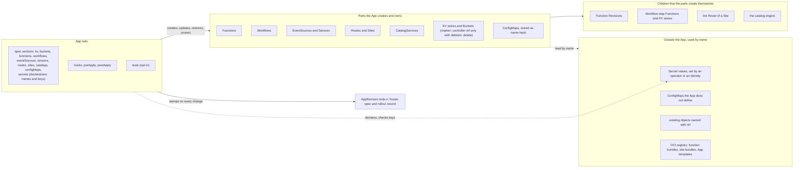
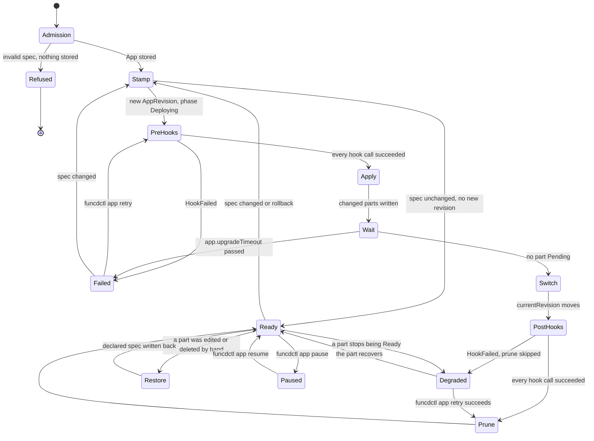
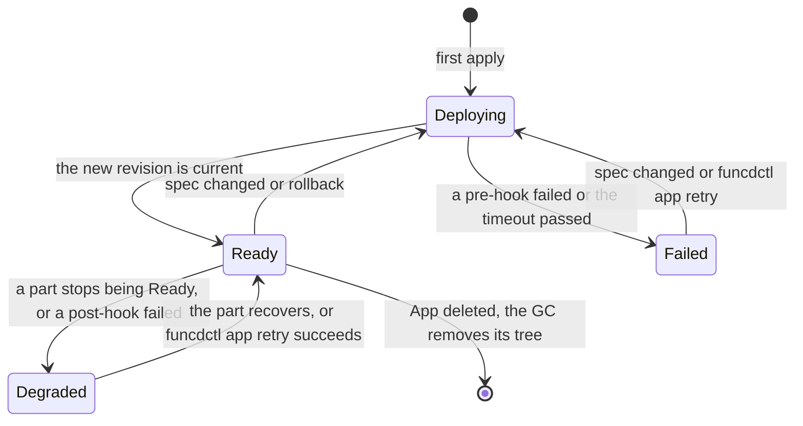
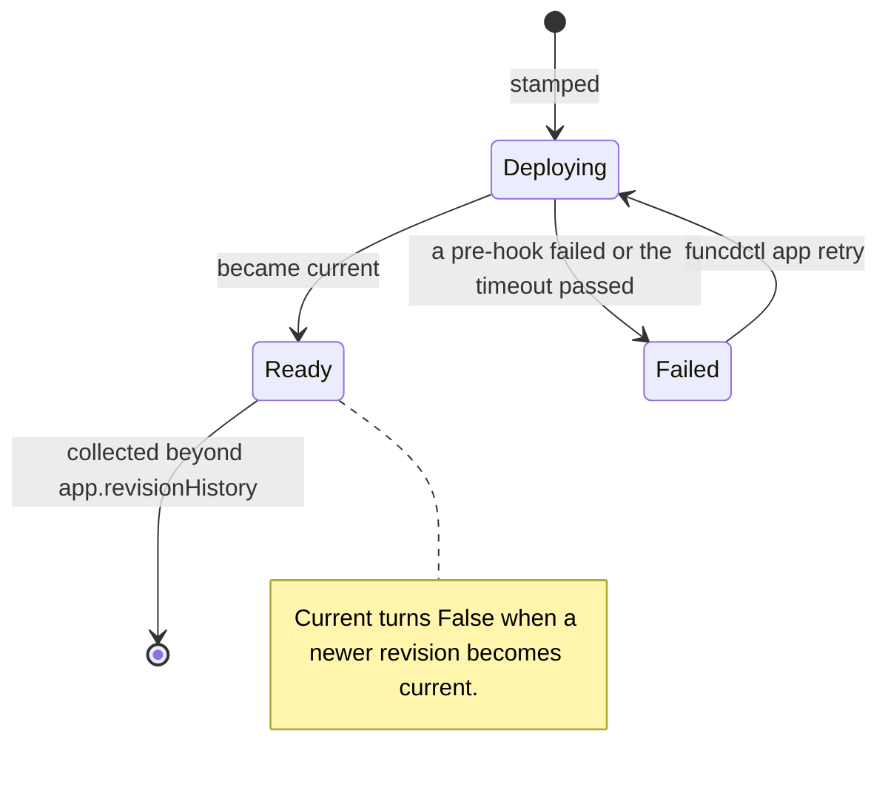
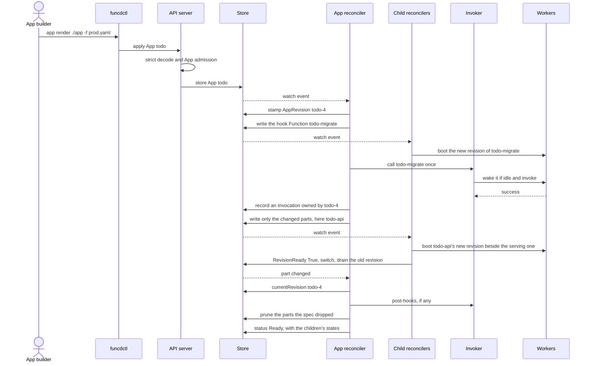
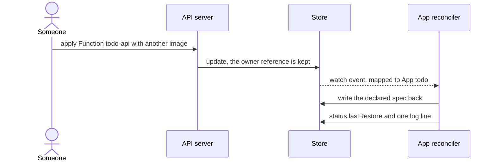

# App design summary

A one-page summary of the App design that was refined with the decider on 2026-10-06 and 2026-10-07. The full
design, with every decision, contract and scenario, is in [app-design.md](app-design.md). It is a design note, not
an ADR yet.

## 1. What an App is

An App is funcd's built-in operator for user apps. It is one namespaced resource that declares every part of an
application in typed sections, the way a Workflow declares its steps: Functions, Workflows, EventSources, Sensors,
Routes, Sites, CatalogServices, KV stores, Buckets and ConfigMaps. funcd checks the parts when the App is applied,
creates them, reports one status, stamps an immutable AppRevision for each change, restores parts that someone
edits by hand, runs the App's hooks, removes what a new version dropped, and rolls back by revision. A client-side
template gives values and reuse across installs, and it can be pushed to an OCI registry like a Helm chart.

- The App spec is the source; the server never pulls a template.
- A rollout writes only the parts whose spec changed; the other parts keep running.
- The App builder, a person or an agent, decides which component versions work together.

## 2. What an App contains, and what stays outside



## 3. Example: the files of the to-do app

```
todo/
├── app/                          the App template, pushable with funcdctl push --template
│   ├── app.yaml                  name, version, valuesSchema (JSON Schema), when per file
│   ├── values/
│   │   ├── dev.yaml              install values for dev, kept in git
│   │   └── prod.yaml             install values for prod, kept in git
│   └── resources/                fragments of the App spec, merged by funcdctl app render
│       ├── store.yaml            kv: todo-store (retain), todo-cache (delete)
│       ├── files.yaml            buckets: todo-files
│       ├── api.yaml              functions and routes: todo-api on /api
│       ├── planner.yaml          functions: todo-planner
│       ├── migrate.yaml          functions: todo-migrate, called by the preApply hook
│       ├── plan.yaml             workflows: todo-plan
│       ├── schedule.yaml         eventSources and sensors: the hourly timer
│       ├── stats.yaml            functions and routes: todo-stats, when analytics is on
│       ├── lake.yaml             catalogs: todo-lake, when analytics is on
│       ├── web.yaml              sites: todo-web
│       ├── settings.yaml         configMaps: todo-settings
│       ├── secrets.yaml          secrets: todo-stripe-key, declared with its keys, no values
│       ├── hooks.yaml            hooks: preApply calls todo-migrate
│       └── tests.yaml            tests: an HTTP check and a Function call, run on demand
├── functions/                    code, pushed with funcdctl push
│   ├── api/
│   ├── planner/
│   ├── migrate/
│   └── stats/
└── web/dist/                     the front end, pushed with funcdctl push --site
```

Secrets are declared in `resources/secrets.yaml` with their names and keys, so the template documents what the app
needs. Their values are set outside the App, by an operator or as an Identity's credential, and a Function names a
Secret in its own `secrets` field.

## 4. The components involved

| Component | Role for the App | Status |
|---|---|---|
| `funcdctl app render` | expands a template with typed values into one App | new |
| goja (`internal/expr`, ADR-0095) | evaluates the template's `${{ }}` expressions on the client; hooks do not use it | exists |
| `funcdctl push --template` | pushes a template as an OCI artifact | new |
| OCI registry | holds templates, function bundles and site bundles | exists, outside funcd |
| API server and admission (`internal/controlplane`, ADR-0063) | decodes the App strictly and runs the App admission | exists; App admission new |
| Store, the metastore | holds the App, its AppRevisions and its parts; bumps a generation only when a `spec` changes | exists |
| Controller framework (`internal/controller`, ADR-0015) | runs the App reconciler and one watch per part kind | exists |
| App reconciler (`internal/app`) | a materializer one level up: stamp, hooks, apply, wait, switch, prune, self-heal, status | new |
| Child reconcilers | Function (revisions, ADR-0143 switch), Workflow materializer, KV store, Site, Route, CatalogService, EventSource, Sensor: each provisions its own children and reports Ready | exist |
| Invoker (activator, ADR-0033) | calls hook Functions once and wakes them when they are scaled to zero | exists |
| Workers and shims | run the Functions; the handler context gives `kv`, `blob`, `invoke` and `log` | exist; health checks extended |
| Owner garbage collector (`internal/gc`, ADR-0170) | deletes the App's tree; stores follow their `deletion` setting | exists; App pairs new |
| Platform config | `app.upgradeTimeout` (5m) and `app.revisionHistory` (10) | new keys |

## 5. State diagrams

### 5.1 One rollout, as the App reconciler runs it



A paused App writes nothing: no apply, no prune and no restore. The diagram shows it from `Ready` only, to keep it
readable.

### 5.2 App phases



### 5.3 AppRevision phases



## 6. Sequence diagrams

### 6.1 An upgrade with a pre-hook



### 6.2 A part edited by hand



## 7. Scenarios

| Area | Scenarios |
|---|---|
| Install and upgrade | `app-install`, `app-reapply-same-spec`, `app-upgrade`, `app-one-part-changes`, `app-prune-after-current` |
| Failure and rollback | `app-failed-upgrade-keeps-serving`, `app-rollback` |
| Admission and ownership | `app-admission-refuses`, `app-shared-writer-refused`, `app-child-not-owned`, `app-ref-kept-store`, `app-ref-waits` |
| Readiness and health | `app-idle-function-stays-current`, `app-scale-to-zero-not-started`, `app-hung-worker-restarted`, `app-dependency-check` |
| Config and secrets | `app-secret-declared`, `app-secret-undeclared-refused`, `app-config-change-rolls` |
| Drift and pause | `app-drift-restored`, `app-paused-keeps-hotfix` |
| Hooks | `app-pre-hook-migrates`, `app-pre-hook-fails-then-retry`, `app-post-hook-fails` |
| Tests | `app-test-on-demand` |
| Delete | `app-delete-collects-tree` |
| Template | `app-render-matches` |

## 8. The main rules

| Topic | Rule |
|---|---|
| Shape | typed sections; an entry is `name` plus the kind's own spec, or `ref: <name>` for an existing object |
| Names | parts keep their declared names; a template adds a prefix when two installs share a namespace |
| Admission | refuses a repeated name, an invalid entry, an unknown section, and two parts that would write one object |
| Revisions | the platform stamps an AppRevision per spec change; a rollback is a new revision with the old spec |
| Rollout | only changed parts are written; each Function switches by itself when its new revision is ready |
| Readiness | a Function counts by `RevisionReady`; a Function that never started counts as settled (`NotStarted`) |
| Failure | after `app.upgradeTimeout` the revision is `Failed` and the old one stays current; no automatic rollback |
| Prune | runs only after the switch, and is skipped when a post-hook fails |
| Data | stores are kept unless `deletion: delete`; a kept store is used again through `ref` |
| Secrets | declared in the App (name, keys, description); values are managed by the platform; a missing Secret or key holds the rollout; the App never writes a Secret |
| Config | a ConfigMap the App defines is stored as `<name>-<hash>`, so a change rolls the Functions that use it |
| Drift | a part edited or deleted by hand gets its declared spec back at once; `spec.paused` stops every write |
| Health | built in: liveness on every replica, a dependency check in the shim, one probe of the KV engine and blob storage |
| Hooks | `preApply` and `postApply` call Functions of the App once per rollout; `funcdctl app retry` calls failed ones again |
| Tests | `spec.tests` runs only with `funcdctl app test` |
| Rights | parts are written with platform rights, as a Workflow writes its steps |

## 9. Status and debugging

```yaml
status:
  phase: Degraded
  currentRevision: todo-3
  conditions:
    - type: Ready
      status: "False"
      reason: ChildNotReady
      message: "Function/todo-api: Restarting"
  children:
    - kind: Function
      name: todo-api
      state: Pending
    - kind: Function
      name: todo-stats
      state: NotStarted
  lastRestore:
    kind: Function
    name: todo-api
    at: "2026-10-07T12:03:10Z"
```

A person or an agent follows one path: `funcdctl describe app todo`, then `funcdctl app history todo`, then the
first part that is not Ready, with `funcdctl describe` and `funcdctl logs`. A failed hook names its Invocation.

## 10. What the App does not do

- It does not pull a bundle or a template on the server.
- It does not hold or write Secret values: it declares the Secrets it needs, and the platform manages their values.
- It does not judge which component versions work together.
- It does not switch the whole App at once (no app-wide blue-green).
- It does not roll back by itself.
- It does not run hooks through Workflows or goja scripts, and it runs no hook before a delete yet.

## 11. Open questions and follow-ups

| Item | Where it goes |
|---|---|
| Finer RBAC: last writer or a named Identity | the IAM work that adds per-kind roles |
| A hook before a delete, which needs finalizers | later, if a case needs it |
| App dependencies: nesting or ordering | its own topic |
| Cron for timers and BackupSchedule | its own ADR |
| The `backupSchedules` section and the App scope | the DR workload-backup ADR |
| Sections for IAM kinds | when an app needs them |
| Health settings: liveness period, check timeout, probe interval | the health ADR, which also changes the shim contract |
| A start-time check that `app.upgradeTimeout` exceeds `runtime.bootTimeout` | this design, when it becomes an ADR |
| A platform client in a hook's context | its own decision, with the DR backup API |
| Durations in milliseconds instead of nanoseconds | issue #816, under tracker #817 |
| The template format in detail | the next refinement topic |
