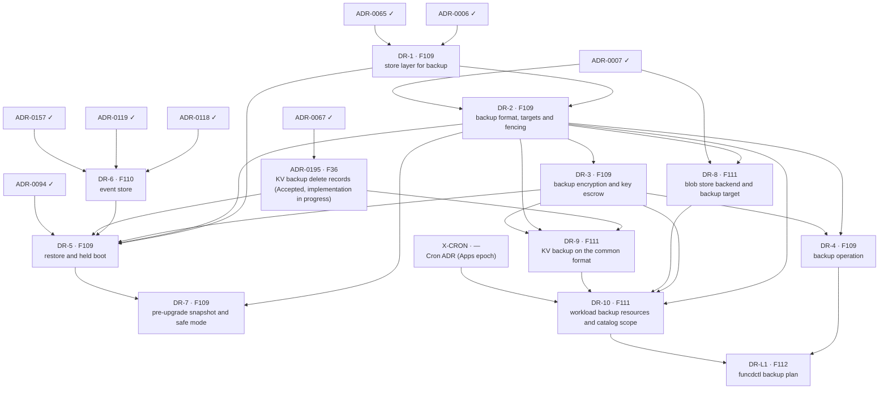

# DR delivery plan — ADR sequencing to ship FEAT-0009

- **Status**: Active (living — update as ADRs are created/accepted/implemented)
- **Date**: 2026-10-07
- **Realizes**: [FEAT-0009 (Disaster recovery)](../feat/0009-feat-disaster-recovery.md)
- **Process**: [ADR-0000](../adr/0000-adr-process.md) · skills `/adr` → `/adr-judge` → `/adr-impl` → `/adr-impl-review`

## Purpose & how to read this

This file sequences the ADRs that realize FEAT-0009's four features (F109 to F112, no gaps) so that the epoch becomes
implementable without dead-ends or stalls. It is a *plan*, not a decision: it commits to no architecture, which is the
ADRs' job. The slate comes from the [design report](../reports/platform-disaster-recovery-design.md), sections I and
J, which hold the ten ADRs of this epoch, the decisions behind them and the order in which to draft them.
[v1-delivery-plan.md](v1-delivery-plan.md) covers FEAT-0000 and is complete; this plan is separate because FEAT-0009
is a later epoch.

**Two tracks.** The *design track* creates, judges and accepts ADRs, and is serialized by review bandwidth. The *build
track* implements and reviews them, and is serialized by hard compile and runtime dependencies. Keep the design track
one wave ahead of the build track.

> **ADR numbers here are placeholders** (`DR-1 …`). `/adr` assigns the real number at creation. Track the work by
> **feature code** (stable). Accepted ADRs use their real number. Other epochs draft ADRs from the same number pool, so
> no number is reserved for this plan.

## Proposed ADR slate

| Plan id | Proposed ADR working title | Realizes | Build-depends on |
|---|---|---|---|
| ADR-0195 | KV backup delete records (Accepted 2026-10-07; implementation in progress) | FEAT-0001/F36 | ADR-0067 |
| X-CRON | Cron ADR of the Apps epoch (outside this plan; the `schedule` field of `BackupSchedule` needs it) | — | — |
| DR-1 | Store layer for backup: one-transaction snapshot, cut order, version timeline | F109 | ADR-0006, ADR-0065 |
| DR-6 | Event store: the dead-letter store extended with the blob seen lists | F110 | ADR-0118, ADR-0119, ADR-0157 |
| DR-2 | Backup format, targets and fencing | F109 | DR-1, ADR-0007 |
| DR-3 | Backup encryption and key escrow | F109 | DR-2 |
| DR-4 | Backup operation: the objectives key, validation across keys, status, metrics, backup-age alert | F109 | DR-2, DR-3 |
| DR-5 | Restore and held boot, with the conformance test and the first drill | F109 | DR-1, DR-2, DR-3, DR-6, ADR-0195, ADR-0094 |
| DR-7 | Pre-upgrade snapshot and safe mode | F109 | DR-2, DR-5 |
| DR-8 | Blob store backend and backup target | F111 | DR-2, ADR-0007 |
| DR-9 | KV backup on the common format | F111 | ADR-0195, DR-2, DR-3 |
| DR-10 | Workload backup resources and catalog scope | F111 | DR-2, DR-3, DR-8, DR-9, X-CRON |
| DR-L1 | `funcdctl backup plan` helper | F112 | DR-4, DR-10 |

The report lists 17 rows in its section I. This slate keeps the ten ADRs that realize FEAT-0009 and the two items
outside it that it needs. P1 of the report became ADR-0195. The rqlite backup parts (W5) belong to the rqlite service
ADRs, and the step idempotency keys (L2) to the workflow epoch; neither realizes FEAT-0009. Three merges are
deliberate: DR-1 joins the snapshot capability and the version timeline (both change the store), DR-5 joins restore
and the held boot (a restore without the hold repeats side effects), and DR-10 joins the workload resources and the
catalog scope. Split DR-5 again if its ADR passes 250 lines.

Each dependency is grounded in one line:

- DR-1 extends the store port and its Badger engine (ADR-0006, ADR-0065).
- DR-2 stores what DR-1 reads and writes it through the blob port (ADR-0007).
- DR-3 puts the encryption envelope into the format of DR-2.
- DR-4 checks the keys that DR-2 and DR-3 define; each ADR defines the keys of its own behavior.
- DR-5 loads DR-1's snapshots from DR-2's format with DR-3's keys, holds the tenants of DR-6's store, applies the KV
  delete records of ADR-0195 and reads the run records of ADR-0094.
- DR-7 takes its snapshots in DR-2's format and boots through DR-5.
- DR-8 writes its backups with DR-2's rules through the blob port.
- DR-9 builds on the delete records of ADR-0195 and on DR-2 and DR-3.
- DR-10 stores its backups with DR-2 and DR-3, copies catalog data through DR-8's blob target, exports KV through DR-9
  and takes its `schedule` syntax from X-CRON.
- DR-L1 reuses the validation of DR-4 and writes the resources of DR-10.

## Build dependency graph

The slate table is authoritative; this graph is generated from it.



## Build waves (computed)

| Tier | Items |
|---|---|
| 0 (done) | ADR-0006, ADR-0007, ADR-0065, ADR-0067, ADR-0094, ADR-0118, ADR-0119, ADR-0157 |
| 1 | ADR-0195, DR-1, DR-6, X-CRON |
| 2 | DR-2 |
| 3 | DR-3, DR-8 |
| 4 | DR-4, DR-5, DR-9 |
| 5 | DR-10, DR-7 |
| 6 | DR-L1 |

Why each tier:

- **Tier 1** needs only built ADRs: DR-1 extends the store, DR-6 extends the eventing stores, ADR-0195 is an accepted
  ADR waiting for its implementation, and X-CRON belongs to the Apps epoch.
- **Tier 2**: DR-2 is the keystone. Every later item stores or reads the format it fixes.
- **Tier 3**: DR-3 wraps the format in encryption, and DR-8 writes the blob store's backups with the format's rules.
  DR-8's backend half (an S3-compatible or local blob store) depends on nothing but ADR-0007 and could ship earlier,
  but nothing waits for it.
- **Tier 4**: DR-4 checks the keys of DR-2 and DR-3, DR-5 restores and holds, DR-9 moves the KV backup onto the common
  format.
- **Tier 5**: DR-10 needs the blob target, the KV format and the Cron decision; DR-7 needs the restore.
- **Tier 6**: DR-L1 reads the validation of DR-4 and writes the resources of DR-10.

### Cross-cutting sequencing notes

- **Keys live with their behavior.** DR-2 defines the target, the credentials, the interval, the start-up check and the
  retention keys; DR-3 defines the recipients. DR-4 adds the objectives key and the checks across keys. No ADR waits for
  another one to define the keys it reads.
- **The test harness.** DR-5 carries the conformance test with deletes and the first drill. A test that assembles a
  platform needs a short data directory (see the known pitfalls in `.claude/CLAUDE.md`).
- **The hold is cross-cutting.** DR-5 must list every runner that has side effects. When the Apps epoch lands, the App
  reconciler and the App hooks join that list.
- **Deletes and snapshots.** DR-1's one-transaction rule is the same rule the KV export follows since #809; ADR-0195
  must be implemented before DR-5 restores a KV instance.

## Design track — what to create + accept ahead

- **Design wave 1** (while ADR-0195 is implemented): draft DR-6 and DR-1. Both depend only on built ADRs.
- **Design wave 2** (while DR-1 and DR-6 are built): draft DR-2, then DR-3 as soon as DR-2 is Accepted.
- **Design wave 3**: draft DR-4 and DR-5.
- **Design wave 4**: draft DR-7, DR-8 and DR-9, then DR-10 once the Cron ADR of the Apps epoch is Accepted.
- **Review attention.** DR-2 carries the fencing rule, the credential model and a change to the blob port. DR-5 is the
  biggest merge and the hold touches every runner. DR-3 holds the key custody. DR-1 changes the resource version, which
  four places of the code parse as a number.

## Critical path & the exit-criterion spine

Critical path (7 items, the longest build chain):

  ADR-0006 → DR-1 → DR-2 → DR-3 → DR-9 → DR-10 → DR-L1

| Exit-criterion clause (FEAT-0009) | Needs (items) |
|---|---|
| F110: the dead letters and the list of fired blob objects live in one store; a restart on a file-based store keeps them | DR-6 |
| F109: a backup runs on schedule and is encrypted | DR-1, DR-2, DR-3 |
| F109: a failed start-up check or a missing key stops the backup and says why | DR-2, DR-3, DR-4 |
| F109: a restore into an empty data directory boots held, with every resource, run record and dead letter of the last backup | DR-5 (with DR-1, DR-2, DR-3, DR-6, ADR-0195) |
| F109: a client that holds a version from before the restore gets a conflict | DR-1, DR-5 |
| F109: the release turns the held parts on | DR-5 |
| F109: an upgrade first snapshots the platform, and a platform that keeps crashing starts on the last good copy, held | DR-7 |
| F111: an app owner backs up a KV store, a bucket and a catalog on a schedule, restores into a new name and swaps it in | DR-10 (with DR-8, DR-9, X-CRON) |
| F111: the backups of a deleted App stay until their time to live | DR-10 |
| F111: the blob store runs on an S3-compatible target and a backup of it restores | DR-8 |
| F111: the KV backup follows the same rules as the platform backup | DR-9 |
| F112: from objectives, funcdctl prints the settings, says when a recovery time is impossible, and shares the start-up rules | DR-L1 (with DR-4) |
| A drill restores a platform and an app's data on a new host from the target and the escrow set alone | DR-5 and DR-10 |

Every clause has an item. The core of the exit criterion is met at tier 5 (DR-10 and DR-7); DR-L1 at tier 6 trails
as the helper that the feature table marks as later.

## Parallelization & sequencing notes

- **Leaf:** DR-7 (nothing depends on it and it is off the critical path) can be deferred.
- **Parallel inside tiers:** DR-1 and DR-6 in tier 1; DR-3 and DR-8 in tier 3; DR-4, DR-5 and DR-9 in tier 4; DR-10
  and DR-7 in tier 5.
- **Riskiest ADRs:** DR-2 (fencing and the blob port), DR-5 (the hold and the merge) and DR-1 (the version timeline).
- **Off the spine, can trail:** DR-L1.
- **Outside owners:** X-CRON belongs to the Apps epoch. ADR-0195 is implemented by the fix pipeline; its board card
  tracks it.

## Reproducing & maintaining this plan

```bash
python3 .claude/skills/roadmap-planner/scripts/plan_waves.py docs/roadmap/dr-plan.json
python3 .claude/skills/roadmap-planner/scripts/plan_waves.py docs/roadmap/dr-plan.json --check-waves
```

When an ADR reaches `Implemented`, move it from `items` to `accepted` in `dr-plan.json` and re-run. When an ADR is
drafted, note its number against its plan id in the caveats below.

## Caveats (living doc)

- Real ADR numbers are assigned by `/adr` at creation; reconcile the `DR-n` placeholders as ADRs land.
- Waves are dependency tiers, not a schedule. Within a wave, sequence by review bandwidth.
- If a drafted ADR reveals a missed dependency, update `dr-plan.json` and re-run the tool; re-validate the graph. The
  accepted ADR still wins for architecture; this plan only tracks ordering.
- The plan does not cover the rqlite backup parts, the step idempotency keys or the app-level consistent cut. The first
  two belong to other epochs; the third is deferred (see the open questions of FEAT-0009).
