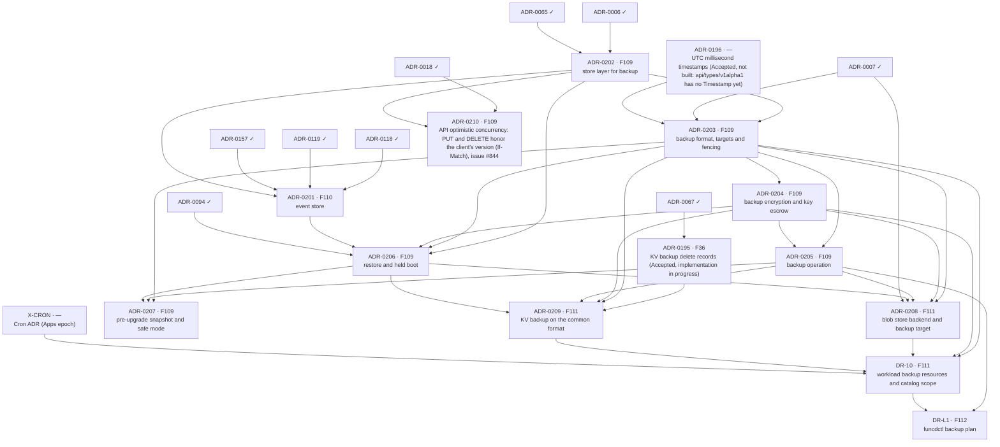

# DR delivery plan — ADR sequencing to ship FEAT-0009

- **Status**: Active (living — update as ADRs are created/accepted/implemented)
- **Date**: 2026-10-07
- **Realizes**: [FEAT-0009 (Disaster recovery)](../feat/0009-feat-disaster-recovery.md)
- **Process**: [ADR-0000](../adr/0000-adr-process.md) · skills `/adr` → `/adr-judge` → `/adr-impl` → `/adr-impl-review`

## Purpose & how to read this

This file sequences the ADRs that realize FEAT-0009's four features (F109 to F112, no gaps) so that the epoch becomes
implementable without dead-ends or stalls. It is a *plan*, not a decision: it commits to no architecture, which is the
ADRs' job. The slate comes from the [design report](../reports/platform-disaster-recovery-design.md), sections I and
J, which hold the ten ADRs of this epoch, the decisions behind them and the order in which to draft them.
[v1-delivery-plan.md](v1-delivery-plan.md) covers FEAT-0000 and is complete; this plan is separate because FEAT-0009
is a later epoch.

**Two tracks.** The *design track* creates, judges and accepts ADRs, and is serialized by review bandwidth. The *build
track* implements and reviews them, and is serialized by hard compile and runtime dependencies. Keep the design track
one wave ahead of the build track.

> **ADR numbers.** The ten ADRs drafted so far are ADR-0201 to ADR-0210 (Proposed, 2026-10-08), taken from the number
> pool that every epoch shares. `DR-10` (workload resources) and `DR-L1` keep their placeholders until they are
> drafted. Track the work by **feature code** (stable). Accepted ADRs use their real number.

## Proposed ADR slate

| Plan id | Proposed ADR working title | Realizes | Build-depends on |
|---|---|---|---|
| ADR-0195 | KV backup delete records (Accepted 2026-10-07; implementation in progress) | FEAT-0001/F36 | ADR-0067 |
| ADR-0196 | UTC millisecond timestamps (Accepted 2026-10-07, not built; ADR-0203 needs `v1.Timestamp`) | FEAT-0000/F02 | — |
| X-CRON | Cron ADR of the Apps epoch (outside this plan; the `schedule` field of `BackupSchedule` needs it) | — | — |
| ADR-0202 | Store layer for backup: one-transaction snapshot, cut order, version timeline | F109 | ADR-0006, ADR-0065 |
| ADR-0201 | Event store: the dead-letter store extended with the blob seen lists | F110 | ADR-0118, ADR-0119, ADR-0157, ADR-0202 |
| ADR-0203 | Backup format, targets and fencing | F109 | ADR-0202, ADR-0007, ADR-0196 |
| ADR-0204 | Backup encryption and key escrow | F109 | ADR-0203 |
| ADR-0205 | Backup operation: the objectives key, validation across keys, status, metrics, backup-age alert | F109 | ADR-0203, ADR-0204 |
| ADR-0206 | Restore and held boot, with the conformance test and the first drill | F109 | ADR-0202, ADR-0203, ADR-0204, ADR-0201, ADR-0094 |
| ADR-0207 | Pre-upgrade snapshot and safe mode | F109 | ADR-0203, ADR-0205, ADR-0206 |
| ADR-0208 | Blob store backend and backup target | F111 | ADR-0203, ADR-0204, ADR-0205, ADR-0206, ADR-0007 |
| ADR-0209 | KV backup on the common format | F111 | ADR-0195, ADR-0203, ADR-0204, ADR-0205, ADR-0206 |
| DR-10 | Workload backup resources and catalog scope | F111 | ADR-0203, ADR-0204, ADR-0208, ADR-0209, X-CRON |
| ADR-0210 | API optimistic concurrency: replace and delete honor the client's resourceVersion (If-Match), issue #844 | F109 | ADR-0018, ADR-0202 |
| DR-L1 | `funcdctl backup plan` helper | F112 | ADR-0205, DR-10 |

The report lists 17 rows in its section I. This slate keeps the ADRs that realize FEAT-0009 and the three items
outside it that it needs: ADR-0195 (KV delete records), ADR-0196 (UTC timestamps) and X-CRON. P1 of the report became
ADR-0195. ADR-0210 (issue #844) was added after the report. The rqlite backup parts (W5) belong to the rqlite service
ADRs, and the step idempotency keys (L2) to the workflow epoch; neither realizes FEAT-0009. Three merges are
deliberate: ADR-0202 joins the snapshot capability and the version timeline (both change the store), ADR-0206 joins restore
and the held boot (a restore without the hold repeats side effects), and DR-10 joins the workload resources and the
catalog scope. Split ADR-0206 again if its ADR passes 250 lines.

Each dependency is grounded in one line:

- ADR-0202 extends the store port and its Badger engine (ADR-0006, ADR-0065).
- ADR-0201 builds on the event stores (ADR-0118, ADR-0119, ADR-0157) and on the snapshot port of ADR-0202.
- ADR-0203 stores what ADR-0202 reads, writes it through the blob port (ADR-0007) and needs `v1.Timestamp` from ADR-0196.
- ADR-0204 puts the encryption envelope into the format of ADR-0203.
- ADR-0205 checks the keys that ADR-0203 and ADR-0204 define; each ADR defines the keys of its own behavior.
- ADR-0206 loads ADR-0202's snapshots from ADR-0203's format with ADR-0204's keys, holds the tenants of ADR-0201's store and reads
  the run records of ADR-0094. It applies the KV delete records of ADR-0195 through ADR-0209 (see the sequencing notes).
- ADR-0207 takes its snapshots in ADR-0203's format, reports through ADR-0205 and boots through ADR-0206.
- ADR-0208 writes its backups with ADR-0203's rules through the blob port, and relies on the operation of ADR-0205 and the
  restore of ADR-0206.
- ADR-0209 builds on the delete records of ADR-0195, on ADR-0203 and ADR-0204, and on the operation (ADR-0205) and restore
  (ADR-0206) that it joins.
- ADR-0210 changes the API's replace and delete (ADR-0018) to honor the client's version, which ADR-0202 defines.
- DR-10 stores its backups with ADR-0203 and ADR-0204, copies catalog data through ADR-0208's blob target, exports KV through ADR-0209
  and takes its `schedule` syntax from X-CRON.
- DR-L1 reuses the validation of ADR-0205 and writes the resources of DR-10.

## Build dependency graph

The slate table is authoritative; this graph is generated from it.



## Build waves (computed)

| Tier | Items |
|---|---|
| 0 (done) | ADR-0006, ADR-0007, ADR-0018, ADR-0065, ADR-0067, ADR-0094, ADR-0118, ADR-0119, ADR-0157 |
| 1 | ADR-0195, ADR-0196, ADR-0202, X-CRON |
| 2 | ADR-0201, ADR-0203, ADR-0210 |
| 3 | ADR-0204 |
| 4 | ADR-0205, ADR-0206 |
| 5 | ADR-0207, ADR-0208, ADR-0209 |
| 6 | DR-10 |
| 7 | DR-L1 |

Why each tier:

- **Tier 1** needs only built ADRs or none: ADR-0202 extends the store, ADR-0196 and ADR-0195 are Accepted and wait for their
  implementation, and X-CRON belongs to the Apps epoch.
- **Tier 2**: ADR-0203 is the keystone, since every later item stores or reads the format it fixes; it needs ADR-0202 and
  ADR-0196 from tier 1. ADR-0201 needs the snapshot port of ADR-0202. ADR-0210 needs the version of ADR-0202.
- **Tier 3**: ADR-0204 wraps the format in encryption.
- **Tier 4**: ADR-0205 checks the keys of ADR-0203 and ADR-0204. ADR-0206 restores and holds; it waits for ADR-0201 and ADR-0204.
- **Tier 5**: ADR-0207 needs the restore. ADR-0208 and ADR-0209 need the operation (ADR-0205) and the restore (ADR-0206).
  ADR-0208's backend half (an S3-compatible or local blob store) depends on nothing but ADR-0007 and could ship earlier, but
  nothing waits for it.
- **Tier 6**: DR-10 needs the blob target, the KV format and the Cron decision.
- **Tier 7**: DR-L1 reads the validation of ADR-0205 and writes the resources of DR-10.

### Cross-cutting sequencing notes

- **Keys live with their behavior.** ADR-0203 defines the target, the credentials, the interval, the start-up check and the
  retention keys; ADR-0204 defines the recipients. ADR-0205 adds the objectives key and the checks across keys. No ADR waits for
  another one to define the keys it reads.
- **The test harness.** ADR-0206 carries the conformance test with deletes and the first drill. A test that assembles a
  platform needs a short data directory (see the known pitfalls in `.claude/CLAUDE.md`).
- **The hold is cross-cutting.** ADR-0206 must list every runner that has side effects. When the Apps epoch lands, the App
  reconciler and the App hooks join that list.
- **Deletes and snapshots.** ADR-0202's one-transaction rule is the same rule the KV export follows since #809; ADR-0195
  must be implemented before ADR-0209 restores a KV instance.
- **Timestamps.** ADR-0196 must be built before ADR-0203, which needs `v1.Timestamp`.

## Design track — what to create + accept ahead

- **Design wave 1** (while ADR-0195 and ADR-0196 are implemented): draft ADR-0202.
- **Design wave 2** (while ADR-0202 is built): draft ADR-0203, ADR-0201 and ADR-0210, then ADR-0204 as soon as ADR-0203 is Accepted.
- **Design wave 3**: draft ADR-0205 and ADR-0206.
- **Design wave 4**: draft ADR-0207, ADR-0208 and ADR-0209, then DR-10 once the Cron ADR of the Apps epoch is Accepted.
- **Review attention.** ADR-0203 carries the fencing rule, the credential model and a change to the blob port. ADR-0206 is the
  biggest merge and the hold touches every runner. ADR-0204 holds the key custody. ADR-0202 changes the resource version, which
  six places of the code parse as a number; ADR-0210 and ADR-0206 rely on that change.

## Critical path & the exit-criterion spine

Critical path (8 items, the longest build chain):

  ADR-0006 → ADR-0202 → ADR-0203 → ADR-0204 → ADR-0205 → ADR-0208 → DR-10 → DR-L1

| Exit-criterion clause (FEAT-0009) | Needs (items) |
|---|---|
| F110: the dead letters and the list of fired blob objects live in one store; a restart on a file-based store keeps them | ADR-0201 |
| F109: a backup runs on schedule and is encrypted | ADR-0202, ADR-0203, ADR-0204 (with ADR-0196) |
| F109: a failed start-up check or a missing key stops the backup and says why | ADR-0203, ADR-0204, ADR-0205 |
| F109: a restore into an empty data directory boots held, with every resource, run record and dead letter of the last backup | ADR-0206 (with ADR-0202, ADR-0203, ADR-0204, ADR-0201, ADR-0209 for KV) |
| F109: a client that holds a version from before the restore gets a conflict | ADR-0202, ADR-0210, ADR-0206 |
| F109: the release turns the held parts on | ADR-0206 |
| F109: an upgrade first snapshots the platform, and a platform that keeps crashing starts on the last good copy, held | ADR-0207 |
| F111: an app owner backs up a KV store, a bucket and a catalog on a schedule, restores into a new name and swaps it in | DR-10 (with ADR-0208, ADR-0209, X-CRON) |
| F111: the backups of a deleted App stay until their time to live | DR-10 |
| F111: the blob store runs on an S3-compatible target and a backup of it restores | ADR-0208 |
| F111: the KV backup follows the same rules as the platform backup | ADR-0209 |
| F112: from objectives, funcdctl prints the settings, says when a recovery time is impossible, and shares the start-up rules | DR-L1 (with ADR-0205) |
| A drill restores a platform and an app's data on a new host from the target and the escrow set alone | ADR-0206 and DR-10 |

Every clause has an item. The core of the exit criterion is met at tier 6 (DR-10, with ADR-0207 in tier 5); DR-L1 at tier 7 trails
as the helper that the feature table marks as later.

## Parallelization & sequencing notes

- **Leaf:** ADR-0207 (nothing depends on it and it is off the critical path) can be deferred.
- **Parallel inside tiers:** ADR-0195, ADR-0196 and ADR-0202 in tier 1; ADR-0201, ADR-0203 and ADR-0210 in tier 2; ADR-0205 and
  ADR-0206 in tier 4; ADR-0207, ADR-0208 and ADR-0209 in tier 5.
- **Riskiest ADRs:** ADR-0203 (fencing and the blob port), ADR-0206 (the hold and the merge) and ADR-0202 (the version timeline).
- **Off the spine, can trail:** DR-L1, ADR-0207 and ADR-0210.
- **Outside owners:** X-CRON belongs to the Apps epoch. ADR-0195 is implemented by the fix pipeline; its board card
  tracks it. ADR-0196 belongs to the platform-wide types.

## Reproducing & maintaining this plan

```bash
python3 .claude/skills/roadmap-planner/scripts/plan_waves.py docs/roadmap/dr-plan.json
python3 .claude/skills/roadmap-planner/scripts/plan_waves.py docs/roadmap/dr-plan.json --check-waves
```

When an ADR reaches `Implemented`, move it from `items` to `accepted` in `dr-plan.json` and re-run. When an ADR is
drafted, note its number against its plan id in the caveats below.

## Caveats (living doc)

- ADR-0201 to ADR-0210 replaced their `DR-n` placeholders on 2026-10-08; `DR-10` and `DR-L1` keep theirs until they are drafted.
  ADR-0196 and ADR-0210 entered the plan after the first slate.
- Waves are dependency tiers, not a schedule. Within a wave, sequence by review bandwidth.
- If a drafted ADR reveals a missed dependency, update `dr-plan.json` and re-run the tool; re-validate the graph. The
  accepted ADR still wins for architecture; this plan only tracks ordering.
- The plan does not cover the rqlite backup parts, the step idempotency keys or the app-level consistent cut. The first
  two belong to other epochs; the third is deferred (see the open questions of FEAT-0009).
