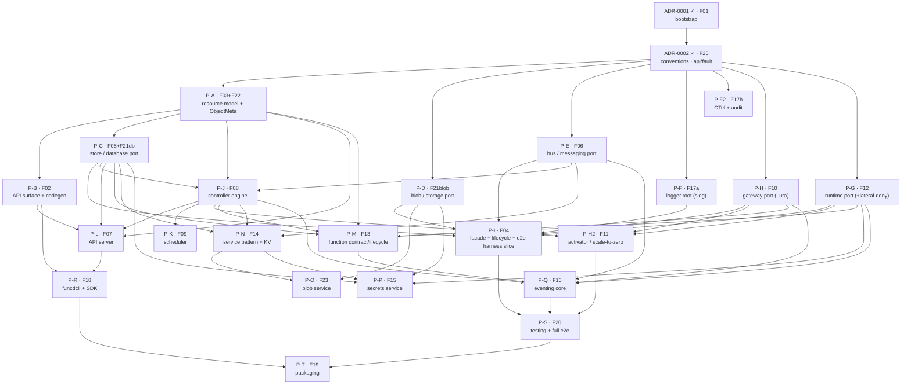

# V1 delivery plan — ADR sequencing to ship FEAT-0000

- **Status**: Active (living — update as ADRs are created/accepted/implemented)
- **Date**: 2026-06-13
- **Realizes**: [FEAT-0000 (V1 — Agent-ready core)](../feat/0000-feat-v1.md)
- **Process**: [ADR-0000](../adr/0000-adr-process.md) · skills `/adr` → `/adr-judge` → `/adr-scaffold`

## Purpose & how to read this

FEAT-0000 lists 24 features (numbering runs F01–F23 + F25; **F24 is unused** — a gap, not a missing
row); this file sequences the **ADRs** that realize them so V1 becomes implementable without
dead-ends or stalls. It is a *plan*, not a decision — it commits to no architecture (that is the
ADRs' job). It answers three questions: in what order must things be built, what can run in
parallel, and which ADRs must be created+accepted ahead of time so a build step never waits on an
undecided question.

**Two tracks — the core idea** (this design/build framing is this plan's own lens, not ADR-0000
vocabulary). Keep them distinct:
- **Design track** — create + judge + accept ADRs. Cheap, and ADRs for independent topics can be
  drafted in parallel; the real serialization point is *your* review/acceptance bandwidth.
- **Build track** — scaffold (`/adr-scaffold`) + implement + validate. Serialized by **hard
  compile/runtime dependencies** (you can't build the controller before the store port exists).

The whole strategy: **keep the design track ~one wave ahead of the build track**, so every time the
build track finishes a wave, the next wave's ADRs are already Accepted and ready to scaffold. An ADR
only needs to be Accepted before *its own* feature is scaffolded — not before anything else.

> **ADR numbers here are proposed placeholders** (`P-A … P-T`). The `/adr` skill assigns the real
> sequential number at creation time, so if you create them in a different order the numbers differ.
> The stable identifiers are the **feature codes** (`F0x`) — track by those. `ADR-0001`/`ADR-0002`
> are real (Accepted).

## Proposed ADR slate

| Plan id | Proposed ADR working title | Realizes | Build-depends on (features) |
|---|---|---|---|
| ADR-0001 ✓ | Project setup, structure, Nix | F01 | — |
| ADR-0002 ✓ | Source-code conventions (`api/fault`, facade, lint graph) | F25 | F01 |
| **P-A** | Resource model & API typing (v1alpha1 kinds, `ObjectMeta` w/ resourceGroup+tags, spec/status, typed IDs/enums) | F03, F22 | F25 |
| **P-B** | API surface & codegen (OpenAPI-first, oapi-codegen strict server/client/types, drift CI, generated-file lint exemption) | F02 | F03 |
| **P-C** | Store / database-layer port (`store.Store`: memory+sqlite, watch, generations, contract suite) | F05, F21(db) | F03, F25 |
| **P-D** | Blob / storage-layer port (`blob.Bucket`: gocloud mem/file/s3, contract suite) | F21(blob) | F25 |
| **P-E** | Messaging / bus port (`bus.Bus`: embedded NATS/JetStream + in-mem, accounts/ns, contract suite) | F06 | F25 |
| **P-F** | Observability — logger root (slog construction + injection from config) | F17 (logger) | F25 |
| **P-F2** | Observability — OTel metrics/traces + audit channel | F17 (telemetry) | F25 |
| **P-G** | Function runtime port (`runtime.Runtime`: process + containerd/runc curated runtimes; netns wiring + nftables lateral-deny; worker/shim seam) | F12 | F25 |
| **P-H** | Gateway port (embedded Lura + dev driver; route programming) | F10 | F25 |
| **P-H2** | Activator & scale-to-zero (request buffer + wake; idle reclaim driven by `scaling` spec) | F11 | F10, F12, F08 |
| **P-I** | Platform facade & lifecycle (`pkg/funcd` New/options/presets; composition root; crash-only boot reconcile; **the `InMemory()` e2e-harness slice**) | F04 | F05, F06, F21, F10, F12, F17(logger) |
| **P-J** | Controller engine & feature-slice pattern (watch→diff→act→status; workqueue/backoff; registry) | F08 | F03, F05, F06 |
| **P-K** | Scheduler (trivial single-node placement behind a pluggable iface) | F09 | F08 |
| **P-L** | API server (authn: tokens+API keys; namespace RBAC; admission validate/default/quota; problem+json) | F07 | F02, F03, F05, F08 |
| **P-M** | Function contract, shape & lifecycle (CloudEvents handler; Knative-func shape; source-artifact deploys; shape-validation pipeline; apply→Revision→deploy→invoke→logs; manual replicas) | F13 | F12, F10, F03, F05, F08 |
| **P-N** | Service facade pattern + KV service (Service resource reconcile + binding + facade; KV as first instance). *V1 authz is namespace-scoped RBAC only — the `auth.Authorizer` PDP/`Grant` enforcement is stubbed, deferred to V2.* | F14 | F06/F05, F08, F03 |
| **P-O** | Blob service (storage layer exposed function-facing, on the service pattern) | F23 | F21(blob), F14-pattern |
| **P-P** | Secrets service (Secret resource; encrypted at rest; env/tmpfs delivery; mem + s3-encryption drivers). *Same V1 authz note as P-N — namespace-scoped, no PDP yet.* | F15 | F05/F21, F14-pattern, F12(delivery) |
| **P-Q** | Eventing core (trigger capture → CloudEvents normalization; HTTP triggers via gateway; timer/cron EventSource) | F16 | F06, F10, F12, F13, F08 |
| **P-R** | CLI & SDK (`funcdcli` kubectl-style + Go SDK over generated client) | F18 | F02, F07 |
| **P-S** | Testing strategy & e2e harness (contract suites per port; e2e on `funcd.InMemory()`; per-driver + Linux-VM lanes; CI pipeline) | F20 | F04 + features under test |
| **P-T** | Packaging & release (static binary, systemd units, install script, version stamping) | F19 | ~everything |

22 new ADRs (P-F/P-H were each split — see below). Merge candidates if the count feels heavy: fold
**P-K (scheduler)** into **P-J (controller)** (single-node placement is trivial); fold **P-O (blob
service)** into **P-D (blob port)** or **P-N (service pattern)**. Don't over-merge the big
integrative ones (P-M, P-Q) — they each carry real, separable decisions.

**Two deliberate splits** (from review): **P-H → P-H (gateway port, F10) + P-H2 (activator/scale-to-
zero, F11)** because F10 builds in wave 2 but F11 in wave 5 — one ADR straddling two build waves
breaks the scaffold→implement model, and the data-plane-ownership decision (gateway) is separable
from the drain/wake decision (scale-to-zero). **P-F → P-F (logger root) + P-F2 (OTel+audit)** because
the logger root is a real prerequisite of the composition root P-I (it builds the root `*slog.Logger`
from `internal/observability`), whereas OTel/audit is heavier and off the critical path. Note: the
*ports* in wave 1 do not depend on P-F — they take a stdlib `*slog.Logger` in their `Deps`; only
**P-I** imports `internal/observability` to construct it.

## Build dependency graph

`X → Y` = X must be *built* before Y. The **slate table above is the authoritative dependency list**;
this graph shows the principal build-order edges (a few transitively-implied edges are omitted for
legibility — e.g. types `P-A` is an ancestor of almost everything).



## Build waves (the build track)

Everything within a wave can be built in parallel; each wave depends on the prior ones.

| Wave | Build in parallel | Gate / why |
|---|---|---|
| **0 — Bootstrap** | ADR-0001, then ADR-0002 | Strictly sequential. Nothing compiles without the module; nothing is conventional without `api/fault` + the facade skeleton + lint graph. **Both already Accepted — they just need `/adr-scaffold` + implement.** |
| **1 — Contracts & substrates** | P-A (types) · P-D (blob) · P-E (bus) · P-F (logger root) | All depend only on conventions. P-A unblocks the most downstream, so prioritize it. blob/bus are independent ports; P-F logger root is small and unblocks P-I. |
| **2 — Codegen, store, runtime, gateway** | P-B (codegen) · P-C (store) · P-G (runtime) · P-H (gateway port) | P-B & P-C need the types (P-A). Runtime & gateway-port need only conventions but are large — slot here so review/build bandwidth isn't all spent in one wave. |
| **3 — Engine** | P-I (facade **+ `InMemory()` e2e-harness slice**) · P-J (controller) · P-K (scheduler) | Facade wires the ports (wave 1–2) and the logger root; controller needs store+bus+types; scheduler needs the controller. **P-I delivers the minimal e2e harness** (see the test-skeleton note below). |
| **4 — Plane services** | P-L (API server) · P-M (function lifecycle) | API server needs codegen+types+store+controller. Function lifecycle needs runtime+gateway+types+store — the first integrative feature. |
| **5 — Scale-to-zero & services** | P-H2 (activator/scale-to-zero) · P-N (service+KV) · P-O (blob svc) · P-P (secrets) · P-Q (eventing) | Activator-wake needs runtime+gateway+controller. Services need their substrate + the service pattern (P-N first, then P-O/P-P reuse it). Eventing needs gateway+runtime+function-lifecycle+bus. P-F2 (OTel/audit) can also land here — off the critical path. |
| **6 — Surfaces & ops** | P-R (CLI/SDK) · P-S (full e2e + CI lanes) · P-T (packaging) | CLI needs the API server; full e2e needs `InMemory()` + the features under test; packaging needs the whole thing compiling and runnable. |

### Test-skeleton sequencing (reconciling with ADR-0000 gate "Scaffold")

ADR-0000 requires each scaffold to emit a skipped test per Scenario. But the e2e harness
(`funcd.InMemory()`) does not exist until **P-I (wave 3)**, so a port scaffolded in waves 1–2 cannot
emit a *compiling e2e* skeleton — and the depguard graph forbids `tests/e2e/**` from importing
`internal/**` anyway. Resolution, applied per wave:

- **Waves 1–2 (ports, pre-harness)**: emit **contract/unit skeletons only** — port-local, available
  immediately, skipped. A Scenario that is inherently end-to-end is recorded in the ADR and gets its
  e2e skeleton deferred to the harness (note it in the scaffold report).
- **Wave 3**: **P-I ships the minimal `InMemory()` e2e-harness slice** as a first-class deliverable.
  From here, e2e skeletons compile and the deferred Scenario tests from waves 1–2 are added against
  the public surface.
- **Wave 6**: **P-S** is the full testing strategy — CI lanes, the Linux-VM containerd lane,
  coverage. Read ADR-0000's "one e2e skeleton per Scenario" as "one *skipped test at the right
  level* per Scenario; e2e once the harness exists" — ADR-0001 already finesses this for itself; this
  is the same accommodation made explicit. (A one-line clarification to ADR-0000 / the `adr-scaffold`
  skill is a sensible follow-up.)

## Design track — what to create + accept ahead

Stay one wave ahead. Acceptance (judge + your sign-off) is the bottleneck, so **batch the next
wave's ADR drafting** while the current wave builds:

- **Now** (building wave 0): draft + accept **P-A** first (it unblocks the most), then **P-D, P-E,
  P-F** — the wave-1 set. P-A, P-D, P-E, P-F are mutually independent, so they can be drafted in
  parallel and judged as they land.
- **While building wave 1**: draft + accept the wave-2 set (**P-B, P-C, P-G, P-H** gateway port).
  The two big ports (runtime P-G, gateway P-H) carry the heaviest decisions (Kata-deferral already
  settled for P-G; the data-plane-ownership reversal for P-H) — give them the most review attention.
- **While building wave 2**: accept **P-I, P-J, P-K**; and draft **P-S (testing strategy) early** —
  even though it's built last, its conventions shape how every feature writes tests (and the P-I
  harness slice in wave 3 should be designed against them), so decide it sooner rather than later.
- Continue rolling one wave ahead through P-L…P-T (incl. P-H2 activator and P-F2 OTel in the wave-5
  batch).

## Critical path & the V1 exit-criterion spine

The longest build chain runs through the integrative features:

```
ADR-0001 → ADR-0002 → P-A → {P-C, P-G} → {P-J, P-H} → P-M → P-Q → P-S → P-T
```
(P-H here is the gateway port; P-H2 activator/scale-to-zero rides in wave 5 alongside the services.)

Map to the [FEAT-0000 exit criterion](../feat/0000-feat-v1.md) ("deploy a JS/Python function from a
source artifact whose handler consumes CloudEvents, reads a secret, persists KV, is invoked over
HTTP + timer, scales to zero, wakes"):

| Exit-criterion clause | Needs (build) |
|---|---|
| deploy JS/Python from artifact | P-G (runtime/curated) + P-M (shape/artifact/lifecycle) |
| handler consumes CloudEvents | P-M (contract) + P-Q (normalization) |
| reads a secret | P-P (secrets) |
| persists KV | P-N (KV) |
| invoked over HTTP | P-H (gateway) + P-Q (HTTP trigger) |
| invoked by timer | P-Q (timer EventSource) |
| scales to zero / wakes | P-H2 (activator) + P-J + P-G |
| all via API/CLI, observable | P-L (API) + P-R (CLI) + P-F (logger) |
| proven | P-S (e2e on `InMemory()` and full Linux-VM lane) |

So the exit criterion is satisfied at the **end of wave 5 + the e2e of wave 6** — P-T (packaging) is
the final polish, not part of proving the feature works.

## Parallelization & sequencing notes

- **Three ports are the big parallel win** (P-C store, P-D blob, P-E bus) — fully independent after
  conventions; getting all three Accepted early unblocks the entire engine wave.
- **Off the critical path** (do whenever convenient / hand to a parallel builder): P-K scheduler,
  P-O blob service, P-F2 OTel/audit, P-T packaging. The blob *service* is not needed by the exit
  criterion (which uses KV + secrets), so it can trail.
- **The two riskiest ADRs** are P-M (function contract/shape/lifecycle — it ties runtime+gateway+
  types together and has open threads on streaming + the Python ASGI-vs-wrapped shape) and P-H
  (gateway — owns the data-path-ownership reversal). Budget extra design + review there.
- **P-F (logger root) is a hard prerequisite of P-I, not of wave-1 ports.** The composition root
  (`internal/app`, in P-I) imports `internal/observability` to build the root `*slog.Logger`; the
  ports only take that stdlib `*slog.Logger` in their `Deps` (no import of P-F). So P-F must land
  before P-I — but it does *not* gate the other wave-1 ports. P-F2 (OTel/audit) is fully off-path.
- **Worker** (`internal/worker`) and **network manager lateral-deny** fold into P-G (runtime) for
  V1 — no separate ADR. Full egress control is V2.

## Caveats (living doc)

- Real ADR numbers are assigned by `/adr` at creation; reconcile this table's `P-x` ids to actual
  numbers as ADRs land, and link them.
- Waves are dependency tiers, not a schedule — within a wave, sequence by review bandwidth.
- If an ADR, once drafted, reveals a dependency this graph missed, update the graph here (newest
  accepted ADR still wins for architecture; this plan just tracks ordering).
- V2/V3 (egress enforcement, gVisor/WASM, Kata microVM, IAM, Terraform provider, …) get their own
  delivery plan when FEAT-0001 is scoped.
