# V1 delivery plan — ADR sequencing to ship FEAT-0000

* **Status**: Active (living — update as ADRs are created/accepted/implemented)
* **Date**: 2026-06-13 (refreshed 2026-06-19 — **V1 is feature-complete**: the **secret-injection last mile**
  (**ADR-0057**, formerly placeholder P-W) is **Implemented** and graduates to tier-0, closing the final
  exit-criterion clause — a deployed handler now **reads a secret** (a Function declares `spec.secrets`; the
  reconciler resolves them via ADR-0022's PDP-authorized Resolver into the worker env). → **34 ADRs built**
  (0001–0033 + 0049 + 0057, less the superseded 0004). **The V1 build slate is COMPLETE**: every
  exit-criterion clause is delivered and Implemented; **no build item remains**. **P-Z (.deb/.rpm) deferred
  to V2.**)
* **Realizes**: [FEAT-0000 (V1 — Agent-ready core)](../feat/0000-feat-v1.md)
* **Process**: [ADR-0000](../adr/0000-adr-process.md) · skills `/adr` → `/adr-judge` → `/adr-impl` → `/adr-impl-review`

## Purpose & how to read this

FEAT-0000 lists 24 features (numbering runs F01–F23 + F25; **F24 is unused** — a gap, not a missing
row); this file sequences the **ADRs** that realize them so V1 becomes implementable without
dead-ends or stalls. It is a *plan*, not a decision — it commits to no architecture (that is the ADRs' job).

**Two tracks.** *Design track* — create + judge + accept ADRs (serialized by review bandwidth). *Build
track* — implement + review (serialized by hard compile/runtime deps). The whole original slate (P-A…P-T) +
the control-plane keystone (P-U) + the depguard fix (P-Y) + the gateway cleanup (ADR-0029) + the runtime
lane (function execution, OCI artifacts, curated images + crun, data-plane wake, **plus the Python
runtime** — ADR-0049) + the **secret-injection last mile** (**ADR-0057**) are now **built**. **The build
track is complete — no item remains.**

> **The V1 build slate is COMPLETE.** `ADR-0001`–`ADR-0033` + `ADR-0049` + `ADR-0057` (less the superseded
> `ADR-0004`) are **Implemented** (tier 0) — including the runtime lane: **ADR-0030** (function execution /
> shim), **ADR-0031** (oras OCI artifacts), **ADR-0032** (curated images + crun), **ADR-0033** (data-plane
> wake), **ADR-0049** (Python runtime shim + image), and the final **ADR-0057** (secret-injection last
> mile). **Every exit-criterion clause is delivered and Implemented — V1 is feature-complete.** **`P-Z` → V2.**

## Proposed ADR slate

This table **is** the build-dependency input — the *Build-depends on* column is mirrored verbatim in
`v1-plan.json`, which the analyzer consumes. **All slate items are now tier-0 (built)**; there is no
remaining actionable row.

**Tier 0 — built (34 ADRs, all Implemented):** ADR-0001…ADR-0029 + the runtime lane **ADR-0030…ADR-0033** +
the Python runtime **ADR-0049** + the secret last-mile **ADR-0057**.
(0001 setup · 0002 conventions · 0003 resource model · 0005 huma API · 0006 store · 0007 blob · 0008 bus ·
0009 logger · 0010 OTel · 0011 runtime/crun · 0012→0013 gateway · 0014 facade · 0015 controller ·
0016 activator · 0017 scheduler · 0018 API server · 0019 service+KV · 0020 function · 0021 blob service ·
0022 secrets · 0023 eventing · 0024 CLI/SDK · 0025 testing · 0026 packaging · 0027 depguard fix ·
0028 control-plane wiring · 0029 single gateway driver · **0030 function execution / shim** ·
**0031 oras OCI artifact distribution** · **0032 curated images + crun sandboxing** ·
**0033 trigger-driven wake + data-plane serving** · **0049 Python runtime shim + image** ·
**0057 secret-injection last mile**.)

> **Built runtime-lane ADRs** (graduated from placeholders): **P-V-1 = ADR-0030** (function execution — the
> runtime-shim HTTP contract + Node reference shim), **P-V-A = ADR-0031** (OCI artifact distribution via
> [`oras-go`](https://github.com/oras-project/oras-go) — `funcdctl` push + platform pull, content-addressed,
> local OCI layout for dev), **P-V-2 = ADR-0032** (curated runtime images + containerd/crun sandboxing — the
> L4 walk), **P-X = ADR-0033** (gateway data plane + activator as the route upstream so HTTP/timer triggers
> wake a scaled-to-zero function), **P-V-3 = ADR-0049** (Python runtime shim + image — the `new()`/`handle()`
> shape behind the *same* shim contract, the optional second runtime).

**Remaining — none. The build track is complete.** The former last item graduated:

| Plan id | Built as | Realizes | Build-depended on |
|----|----|----|----|
| ~~P-W~~ → **ADR-0057** ✓ | **Secret injection last-mile** — a Function declares `spec.secrets`; the reconciler resolves them (PDP-authorized, ADR-0022) into the worker env. | F15 | ADR-0022, ADR-0030 |

**Deferred to V2 (FEAT-0002):** **P-Z** — distro `.deb`/`.rpm` packaging + a multi-arch release matrix over
the ADR-0026 `build.sh`/ldflags seam (V1 ships the single binary + systemd unit + install docs).

## Build dependency graph

`X → Y` = X must be *built* before Y. Generated from the slate by `plan_waves.py` (`--mermaid-only`) and
mermaid-validated — it cannot drift from the table.

```mermaid
flowchart TB
    ADR_0001["ADR-0001 ✓"]
    ADR_0002["ADR-0002 ✓"]
    ADR_0003["ADR-0003 ✓"]
    ADR_0005["ADR-0005 ✓"]
    ADR_0006["ADR-0006 ✓"]
    ADR_0007["ADR-0007 ✓"]
    ADR_0008["ADR-0008 ✓"]
    ADR_0009["ADR-0009 ✓"]
    ADR_0010["ADR-0010 ✓"]
    ADR_0011["ADR-0011 ✓"]
    ADR_0012["ADR-0012 ✓"]
    ADR_0013["ADR-0013 ✓"]
    ADR_0014["ADR-0014 ✓"]
    ADR_0015["ADR-0015 ✓"]
    ADR_0016["ADR-0016 ✓"]
    ADR_0017["ADR-0017 ✓"]
    ADR_0018["ADR-0018 ✓"]
    ADR_0019["ADR-0019 ✓"]
    ADR_0020["ADR-0020 ✓"]
    ADR_0021["ADR-0021 ✓"]
    ADR_0022["ADR-0022 ✓"]
    ADR_0023["ADR-0023 ✓"]
    ADR_0024["ADR-0024 ✓"]
    ADR_0025["ADR-0025 ✓"]
    ADR_0026["ADR-0026 ✓"]
    ADR_0027["ADR-0027 ✓"]
    ADR_0028["ADR-0028 ✓"]
    ADR_0029["ADR-0029 ✓"]
    ADR_0030["ADR-0030 ✓"]
    ADR_0031["ADR-0031 ✓"]
    ADR_0032["ADR-0032 ✓"]
    ADR_0033["ADR-0033 ✓"]
    ADR_0049["ADR-0049 ✓"]
    ADR_0057["ADR-0057 ✓<br/>secret injection last mile (F15)"]

    ADR_0022 --> ADR_0057
    ADR_0030 --> ADR_0057
```



All nodes are tier-0 (built); the graph is now a record of the build dependencies, not a pending plan.
With `v1-plan.json` `items: []`, `plan_waves.py` reports `no items in plan` — the build track is complete.

## Build waves (computed — `plan_waves.py`)

Analyzer: `no items in plan` — `items: []`, so there are no waves left to compute. The build track is
complete; all 34 ADRs are tier-0.

| Tier | Items | Gate / why |
|----|----|----|
| **0 (done)** | ADR-0001 … **ADR-0033** + **ADR-0049** + **ADR-0057** | The whole control plane + the gateway cleanup + the runtime lane (incl. the Python runtime) + the secret-injection last mile. **All 34 Implemented.** |

**Critical path** (historical): `ADR-0022 → ADR-0057` was the last build edge (2 items), now fully built.
**No remaining items** — V1 is feature-complete.

### Test sequencing (ADR-0025's taxonomy + a new runtime-gated tier)

ADR-0025's L3b embed e2e is a full deploy→reconcile walk (ADR-0028). ADR-0030 **added a named
"L3-runtime" tier**: tests gated on a language runtime (`exec.LookPath("node")`) that run real execution when
node is present and `t.Skip` when absent; the *platform side* (materializer/sandboxSpec/readiness against a
fake shim) stays pure-Go in `just ci`. The **L4 Linux lane** carries the containerized walk (ADR-0032's crun
e2e — the Linux-lane deferral).

## Critical path & the V1 exit-criterion spine

**Every exit-criterion clause is delivered — V1 is feature-complete.** Map to the
[exit criterion](../feat/0000-feat-v1.md):

| Exit-criterion clause | Delivered by | Remaining |
|----|----|----|
| served API + reconcile, all via SDK/CLI | ADR-0028 ✓ + ADR-0018 ✓ + ADR-0024 ✓ | — (done) |
| deploy JS/Python from a source artifact | ADR-0031 ✓ (oras push/pull) + ADR-0030 ✓ (Node runtime) + ADR-0049 ✓ (Python runtime) | — (done) |
| handler consumes CloudEvents | ADR-0020 ✓ + ADR-0023 ✓ + ADR-0030 ✓ (shim invokes the handler with the CloudEvent) | — (done) |
| invoked by a timer | ADR-0023 ✓ (invoker) + ADR-0030 ✓ (the invoke reaches a real handler) | — (done) |
| invoked over HTTP | ADR-0013 ✓ + ADR-0033 ✓ (gateway data plane → activator → shim) | — (done) |
| reads a secret | ADR-0022 ✓ + ADR-0057 ✓ (`spec.secrets` → reconciler resolves → worker env) | — (done) |
| persists KV | ADR-0019 ✓ + ADR-0028 ✓ | in-handler SDK (follow-up; the shim's `context`) |
| scales to zero / wakes | ADR-0016 ✓ + ADR-0015 ✓ + ADR-0033 ✓ (trigger wakes a zeroed fn) | — (done) |
| proven on a Linux box | ADR-0025 ✓ (L1–L3) + ADR-0032 ✓ (the L4 containerized crun walk) | — (done) |

So the V1 walk is complete: deploy + execute (**both Node and Python runtimes**) + consume CloudEvents +
timer/HTTP wake + read a secret + Linux L4 are all serving. **No exit-criterion work remains** — the only
non-blocking follow-up is the in-handler KV SDK (the shim's `context`), already serviced server-side.
The container-e2e proof of the full walk (incl. a handler reading its injected secret) runs in the
ADR-0034 end-user-journey lane.

## Reproducing & maintaining this plan

```bash
python3 .claude/skills/roadmap-planner/scripts/plan_waves.py docs/roadmap/v1-plan.json
python3 .claude/skills/roadmap-planner/scripts/plan_waves.py docs/roadmap/v1-plan.json --check-waves
```

When an ADR reaches `Implemented`, move it from `items` to `accepted` in `v1-plan.json` and re-run — that is
what graduated the runtime-lane **ADR-0030…ADR-0033**, the Python runtime **ADR-0049**, and the final
secret-injection **ADR-0057** to tier-0 here. With `items: []`, the analyzer now reports `no items in plan`:
the V1 build track is complete. The next time `items` is non-empty is when V2 (FEAT-0002) is scoped
(v1.1 / FEAT-0001 — statically-defined I/O contracts — is tracked in its own feat doc, not this plan).

## Caveats (living doc)

* **P-x → ADR map** (all built unless noted): A→0003, B→0004→**0005**, C→0006, D→0007, E→0008, F→0009, F2→0010,
  G→0011, H→0012→**0013**→**0029** (Lura dropped), I→0014, J→0015, H2→0016, K→0017, L→0018, N→0019, M→0020,
  O→0021, P→0022, Q→0023, R→0024, S→0025, T→0026, Y→0027, U→0028. **P-V split → P-V-1=ADR-0030 (built) /
  P-V-A=ADR-0031 (built) / P-V-2=ADR-0032 (built) / P-V-3=ADR-0049 (built)**, **P-X=ADR-0033 (built)**, and
  **P-W=ADR-0057 (built)** — the secret-injection last mile. **Every plan item is now built; P-Z → V2.**
* **The runtime lane's design decisions** (from the ADR-0030…ADR-0033 + ADR-0049 builds): the **shim** is a
  seam (one HTTP contract, run by the process driver in dev and crun in prod) — **both the Node (ADR-0030) and
  Python (ADR-0049) runtimes sit behind the same contract**; **artifact distribution is OCI via
  oras-go** (`funcdctl` push + platform pull, content-addressed, local OCI layout for dev — no registry
  server, no blob-as-artifact-store); execution moves readiness to the shim's `/health/readiness` (refines
  ADR-0020) and surfaces a per-replica loopback endpoint (refines ADR-0011's `Instance`); the data-plane wake
  (ADR-0033) mounts the gateway + activator as the route upstream so triggers wake a scaled-to-zero function.
* Tiers are dependency floors, not a schedule. When FEAT-0002 (V2 — egress enforcement, gVisor/WASM, Kata
  microVM, IAM/PDP, distro packaging P-Z, multi-node, an external-gateway driver, …) is scoped, the line
  between "finish V1's walk" and "V2" is drawn there.
