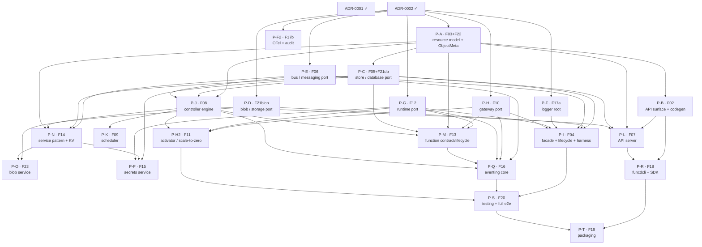

# V1 delivery plan — ADR sequencing to ship FEAT-0000

- **Status**: Active (living — update as ADRs are created/accepted/implemented)
- **Date**: 2026-06-13
- **Realizes**: [FEAT-0000 (V1 — Agent-ready core)](../feat/0000-feat-v1.md)
- **Process**: [ADR-0000](../adr/0000-adr-process.md) · skills `/adr` → `/adr-judge` → `/adr-impl` → `/adr-impl-review`

## Purpose & how to read this

FEAT-0000 lists 24 features (numbering runs F01–F23 + F25; **F24 is unused** — a gap, not a missing
row); this file sequences the **ADRs** that realize them so V1 becomes implementable without
dead-ends or stalls. It is a *plan*, not a decision — it commits to no architecture (that is the
ADRs' job). It answers three questions: in what order must things be built, what can run in
parallel, and which ADRs must be created+accepted ahead of time so a build step never waits on an
undecided question.

**Two tracks — the core idea** (this design/build framing is this plan's own lens, not ADR-0000
vocabulary). Keep them distinct:
- **Design track** — create + judge + accept ADRs. Cheap, and ADRs for independent topics can be
  drafted in parallel; the real serialization point is *your* review/acceptance bandwidth.
- **Build track** — implement (`/adr-impl`) + review (`/adr-impl-review`). Serialized by **hard
  compile/runtime dependencies** (you can't build the controller before the store port exists).

The whole strategy: **keep the design track ~one tier ahead of the build track**, so every time the
build track finishes a tier, the next tier's ADRs are already Accepted and ready to implement. An ADR
only needs to be Accepted before *its own* feature is implemented — not before anything else.

> **ADR numbers here are proposed placeholders** (`P-A … P-T`). The `/adr` skill assigns the real
> sequential number at creation time, so if you create them in a different order the numbers differ.
> The stable identifiers are the **feature codes** (`F0x`) — track by those. `ADR-0001`/`ADR-0002`
> are real (Accepted).

## Proposed ADR slate

This table **is** the build-dependency input — the *Build-depends on* column lists plan-item ids and
is mirrored verbatim in [`v1-plan.json`](v1-plan.json), which the analyzer consumes. Keep the two in
sync; re-run the analyzer (below) after any edit.

| Plan id | Proposed ADR working title | Realizes | Build-depends on (items) |
|---|---|---|---|
| ADR-0001 ✓ | Project setup, structure, Nix | F01 | — |
| ADR-0002 ✓ | Source-code conventions (`api/fault`, facade, lint graph) | F25 | ADR-0001 |
| **P-A** | Resource model & API typing (v1alpha1 kinds, `ObjectMeta` w/ resourceGroup+tags, spec/status, typed IDs/enums) | F03, F22 | ADR-0002 |
| **P-B** | API surface & codegen (OpenAPI-first, oapi-codegen strict server/client/types, drift CI, generated-file lint exemption) | F02 | P-A |
| **P-C** | Store / database-layer port (`store.Store`: memory+sqlite, watch, generations, contract suite) | F05, F21(db) | P-A |
| **P-D** | Blob / storage-layer port (`blob.Bucket`: gocloud mem/file/s3, contract suite) | F21(blob) | ADR-0002 |
| **P-E** | Messaging / bus port (`bus.Bus`: embedded NATS/JetStream + in-mem, accounts/ns, contract suite) | F06 | ADR-0002 |
| **P-F** | Observability — logger root (slog construction + injection from config) | F17 (logger) | ADR-0002 |
| **P-F2** | Observability — OTel metrics/traces + audit channel | F17 (telemetry) | ADR-0002 |
| **P-G** | Function runtime port (`runtime.Runtime`: process + containerd/runc curated runtimes; netns wiring + nftables lateral-deny; worker/shim seam) | F12 | ADR-0002 |
| **P-H** | Gateway port (embedded Lura + dev driver; route programming) | F10 | ADR-0002 |
| **P-H2** | Activator & scale-to-zero (request buffer + wake; idle reclaim driven by `scaling` spec) | F11 | P-H, P-G, P-J |
| **P-I** | Platform facade & lifecycle (`pkg/funcd` New/options/presets; composition root; crash-only boot reconcile; **the `InMemory()` e2e-harness slice**) | F04 | P-C, P-D, P-E, P-F, P-G, P-H |
| **P-J** | Controller engine & feature-slice pattern (watch→diff→act→status; workqueue/backoff; registry) | F08 | P-A, P-C, P-E |
| **P-K** | Scheduler (trivial single-node placement behind a pluggable iface) | F09 | P-J |
| **P-L** | API server (authn: tokens+API keys; namespace RBAC; admission validate/default/quota; problem+json) | F07 | P-B, P-A, P-C, P-J |
| **P-M** | Function contract, shape & lifecycle (CloudEvents handler; Knative-func shape; source-artifact deploys; shape-validation pipeline; apply→Revision→deploy→invoke→logs; manual replicas) | F13 | P-G, P-H, P-A, P-C, P-J |
| **P-N** | Service facade pattern + KV service (Service resource reconcile + binding + facade; KV as first instance). *V1 authz is namespace-scoped RBAC only — the `auth.Authorizer` PDP/`Grant` enforcement is stubbed, deferred to V2.* | F14 | P-E, P-C, P-J, P-A |
| **P-O** | Blob service (storage layer exposed function-facing, on the service pattern) | F23 | P-D, P-N |
| **P-P** | Secrets service (Secret resource; encrypted at rest; env/tmpfs delivery; mem + s3-encryption drivers). *Same V1 authz note as P-N — namespace-scoped, no PDP yet.* | F15 | P-C, P-N, P-G |
| **P-Q** | Eventing core (trigger capture → CloudEvents normalization; HTTP triggers via gateway; timer/cron EventSource) | F16 | P-E, P-H, P-G, P-M, P-J |
| **P-R** | CLI & SDK (`funcdcli` kubectl-style + Go SDK over generated client) | F18 | P-B, P-L |
| **P-S** | Testing strategy & e2e harness (contract suites per port; e2e on `funcd.InMemory()`; per-driver + Linux-VM lanes; CI pipeline) | F20 | P-I, P-Q, P-H2 |
| **P-T** | Packaging & release (static binary, systemd units, install script, version stamping) | F19 | P-R, P-S |

22 new ADRs (P-F/P-H were each split — see below). Merge candidates if the count feels heavy: fold
**P-K (scheduler)** into **P-J (controller)** (single-node placement is trivial); fold **P-O (blob
service)** into **P-D (blob port)** or **P-N (service pattern)**. Don't over-merge the big
integrative ones (P-M, P-Q) — they each carry real, separable decisions.

**Two deliberate splits** (from review): **P-H → P-H (gateway port, F10) + P-H2 (activator/scale-to-
zero, F11)** because F10 builds at tier 1 but F11 at tier 4 — one ADR straddling build tiers breaks
the one-ADR-one-implementation model, and the data-plane-ownership decision (gateway) is separable from the
drain/wake decision (scale-to-zero). **P-F → P-F (logger root) + P-F2 (OTel+audit)** because the
logger root is a real prerequisite of the composition root P-I (it builds the root `*slog.Logger`
from `internal/observability`), whereas OTel/audit is heavier and off the critical path. Note: the
*ports* in tier 1 do not depend on P-F — they take a stdlib `*slog.Logger` in their `Deps`; only
**P-I** imports `internal/observability` to construct it.

## Build dependency graph

`X → Y` = X must be *built* before Y. This graph is **generated from the slate table by
`plan_waves.py`** (`--mermaid-only`) and mermaid-validated — it cannot drift from the table, and it
shows every edge (no hand-pruning). Regenerate it whenever the slate / `v1-plan.json` changes.



## Build waves (computed — `plan_waves.py`)

These are the **computed earliest tiers**: within a tier there are *zero* dependency edges, so every
item in it is genuinely parallel-safe. (An earlier hand-grouped 6-wave version of this section was
*wrong* — it placed dependents in the same wave as their dependencies (P-K with P-J; P-O/P-P with
P-N; P-T with P-R/P-S), silently contradicting "parallel within a wave". The analyzer's `--check-waves`
mode now catches exactly that; the table below is regenerated, not hand-drawn.) A coarser
capacity-based grouping is fine **iff** it passes `--check-waves`.

| Tier | Items | Gate / why |
|---|---|---|
| **0 (done)** | ADR-0001, ADR-0002 | Bootstrap + conventions. **Accepted — need `/adr-impl` + review.** Nothing compiles or is conventional without them. |
| **1** | P-A · P-D · P-E · P-F · P-F2 · P-G · P-H | Everything that needs only conventions (or, for P-A, only ADR-0002). The big parallel tier — but also the biggest, so sequence within it by capacity; P-A first since tier 2 waits on it. |
| **2** | P-B · P-C | Both need the types (P-A): codegen generates from the resource model; the store persists typed objects. |
| **3** | P-I · P-J | Facade wires the tier-1/2 ports + logger root (**and ships the `InMemory()` e2e-harness slice**); controller needs store+bus+types. |
| **4** | P-H2 · P-K · P-L · P-M · P-N | Activator needs gateway+runtime+controller; scheduler needs controller; API server needs codegen+store+controller; function-lifecycle (first integrative feature) needs runtime+gateway+store+controller; service-pattern+KV needs bus+store+controller. |
| **5** | P-O · P-P · P-Q · P-R | blob/secrets services reuse the service pattern (P-N); eventing needs function-lifecycle+gateway+bus; CLI needs the API server. |
| **6** | P-S | Full testing + CI lanes — needs the harness (P-I), eventing (P-Q), and scale-to-zero (P-H2) to exercise. |
| **7** | P-T | Packaging — the terminal deliverable; everything must compile and run. |

**Critical path** (longest chain, from the analyzer): `ADR-0002 → P-A → P-C → P-J → P-M → P-Q → P-S → P-T`.

### Test sequencing (reconciling with the ADR-0000 "Implement" gate)

ADR-0000 requires each implementation to ship a *passing* test per Scenario. But the e2e harness
(`funcd.InMemory()`) does not exist until **P-I (tier 3)**, so a port implemented in tiers 1–2 cannot
ship a *passing e2e* test — and the depguard graph forbids `tests/e2e/**` from importing
`internal/**` anyway. Resolution, applied per tier:

- **Tiers 1–2 (ports, pre-harness)**: ship **contract/unit tests only** — port-local, available
  immediately, passing. A Scenario that is inherently end-to-end is recorded in the ADR and its
  acceptance test is deferred to the harness (note the deferral in the implementation report; the
  review gate attributes the gap to sequencing, not the model).
- **Tier 3**: **P-I ships the minimal `InMemory()` e2e-harness slice** as a first-class deliverable.
  From here, e2e tests run and the deferred Scenario tests from tiers 1–2 are added against the
  public surface.
- **Tier 6**: **P-S** is the full testing strategy — CI lanes, the Linux-VM containerd lane,
  coverage. Read ADR-0000's "one passing test per Scenario" as "one passing test *at the right level*
  per Scenario; the e2e test once the harness exists."

## Design track — what to create + accept ahead

Stay one tier ahead. Acceptance (judge + your sign-off) is the bottleneck, so **batch the next
tier's ADR drafting** while the current tier builds:

- **Now** (building tier 0): draft + accept the **tier-1 set** — **P-A first** (it gates tier 2),
  then **P-D, P-E, P-F, P-F2, P-G, P-H**. All are mutually independent (each needs only conventions,
  P-A only ADR-0002), so they draft in parallel and are judged as they land. The two big ports
  (runtime P-G, gateway P-H) carry the heaviest decisions (Kata-deferral already settled for P-G;
  the data-plane-ownership reversal for P-H) — give them the most review attention.
- **While building tier 1**: accept the **tier-2 set** (**P-B, P-C**); and draft **P-S (testing
  strategy) early** — even though it builds at tier 6, its conventions shape how every feature writes
  tests, and the P-I harness slice (tier 3) should be designed against them.
- **While building tier 2**: accept **P-I, P-J** (tier 3), then the tier-4 batch (**P-H2, P-K, P-L,
  P-M, P-N**).
- Continue rolling one tier ahead through P-O…P-T.

## Critical path & the V1 exit-criterion spine

The longest build chain (computed by the analyzer) is
`ADR-0002 → P-A → P-C → P-J → P-M → P-Q → P-S → P-T` — 8 items. Protect it: a slip on any of these
slips V1. (P-M function-lifecycle and P-Q eventing are both on it and are the riskiest ADRs.)

Map to the [FEAT-0000 exit criterion](../feat/0000-feat-v1.md) ("deploy a JS/Python function from a
source artifact whose handler consumes CloudEvents, reads a secret, persists KV, is invoked over
HTTP + timer, scales to zero, wakes"):

| Exit-criterion clause | Needs (build) |
|---|---|
| deploy JS/Python from artifact | P-G (runtime/curated) + P-M (shape/artifact/lifecycle) |
| handler consumes CloudEvents | P-M (contract) + P-Q (normalization) |
| reads a secret | P-P (secrets) |
| persists KV | P-N (KV) |
| invoked over HTTP | P-H (gateway) + P-Q (HTTP trigger) |
| invoked by timer | P-Q (timer EventSource) |
| scales to zero / wakes | P-H2 (activator) + P-J + P-G |
| all via API/CLI, observable | P-L (API) + P-R (CLI) + P-F (logger) |
| proven | P-S (e2e on `InMemory()` and full Linux-VM lane) |

So the exit criterion is satisfied by the **end of tier 5** (its features span tiers 4–5), **proven
at tier 6** (P-S), with **tier 7 (P-T packaging)** the final polish — not part of proving the feature
works.

## Parallelization & sequencing notes

- **Three ports are the big parallel win** (P-C store, P-D blob, P-E bus) — independent after
  conventions; accepting them early unblocks the engine tier.
- **Parallelizable leaves** (per the analyzer — nothing depends on them *and* off the critical path,
  so hand to a parallel builder or defer): **P-F2** (OTel/audit), **P-K** (scheduler), **P-O** (blob
  service), **P-P** (secrets). The blob *service* isn't on the exit-criterion path (which uses KV +
  secrets), so it can trail furthest. **P-T (packaging) is a leaf but the terminal sink** — the final
  deliverable, *not* deferrable.
- **The two riskiest ADRs** are P-M (function contract/shape/lifecycle — it ties runtime+gateway+
  types together and has open threads on streaming + the Python ASGI-vs-wrapped shape) and P-H
  (gateway — owns the data-path-ownership reversal). Both are on the critical path. Budget extra
  design + review there.
- **P-F (logger root) is a hard prerequisite of P-I, not of tier-1 ports.** The composition root
  (`internal/app`, in P-I) imports `internal/observability` to build the root `*slog.Logger`; the
  ports only take that stdlib `*slog.Logger` in their `Deps` (no import of P-F). So P-F must land
  before P-I — but it does *not* gate the other tier-1 ports. P-F2 (OTel/audit) is fully off-path.
- **Worker** (`internal/worker`) and **network manager lateral-deny** fold into P-G (runtime) for
  V1 — no separate ADR. Full egress control is V2.

## Reproducing & maintaining this plan

The dependency table, graph, waves, and critical path are **computed**, not hand-drawn — the input is
[`v1-plan.json`](v1-plan.json) (mirrors the slate table's *Build-depends on* column):

```bash
python3 .claude/skills/roadmap-planner/scripts/plan_waves.py docs/roadmap/v1-plan.json
python3 .claude/skills/roadmap-planner/scripts/plan_waves.py docs/roadmap/v1-plan.json --check-waves
```

After any edit to the slate/`v1-plan.json`: re-run to refresh tiers + critical path, paste the
regenerated `--mermaid-only` graph (after mermaid-validating it), and run `--check-waves` if you
present any coarser grouping. The `--check-waves` mode is what would have caught the false-parallelism
this section originally shipped with.

## Caveats (living doc)

- Real ADR numbers are assigned by `/adr` at creation; reconcile this table's `P-x` ids to actual
  numbers as ADRs land, and link them.
- Tiers are dependency floors, not a schedule — within a tier, sequence by review bandwidth.
- If an ADR, once drafted, reveals a dependency this plan missed, update `v1-plan.json`, re-run the
  analyzer, re-validate the graph (newest accepted ADR still wins for architecture; this plan just
  tracks ordering).
- V2/V3 (egress enforcement, gVisor/WASM, Kata microVM, IAM, Terraform provider, …) get their own
  delivery plan when FEAT-0001 is scoped.
